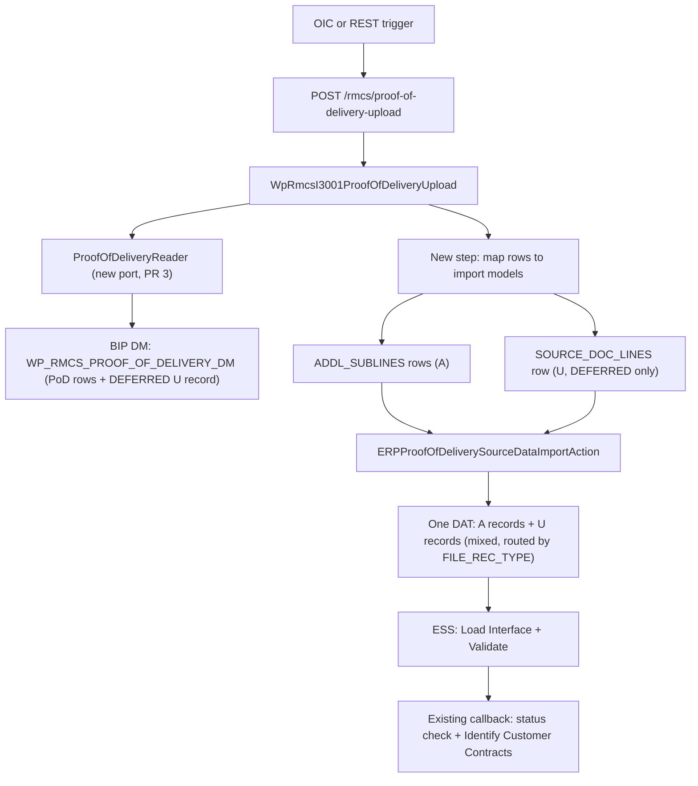

---
name: RMCS-I-3001 Warranty PoD Support
overview: "Extend the RMCS-I-3001 Proof of Delivery upload (OM to RMCS FBDI) to support warranty order lines per FSD v2: 3-way split (COMMISSION/UPFRONT/DEFERRED), per-split fulfillment-date rules computed in the DM, contract-line EFF updates via a second FBDI sheet, and event-specific dedup. Verified on dev1: warranty lines are excluded today (non-shippable items), PIM/item-group DFF sources exist, DFF segment mapping confirmed, and the callback chain needs no changes."
todos:
  - id: phase0-clarifications
    content: "Phase 0: Q9/Q10 resolved 2026-09-30 (concat stays; replacement date follows the replacement order's own type). Q8 RESOLVED 2026-10-01 (Aruna, mapping-sheet thread: billing happens at ship confirm for ALL order types; .2 UPFRONT always on item PoD availability; .3 DEFERRED at earliest of replacement-order PoD / contract end date; 'Yes, each row goes only when its date exists' — confirms the 7a window-move + hold design; DM PENDING CONFIRMATION marker removed). Q12 RESOLVED 2026-10-01 twice — dev1 wipe-test (blanks KEEP values: order TestPoDQ12B, contract 40037, line 39027 intact + DATE1 control applied) AND Aruna's Drive answer ('blanks are intended. RMCS keep the values stored at contract creation and It will not clear. This was already tested during POC') — PRs 9a/9b DROPPED. Q11 RESOLVED 2026-10-01 (Aruna, Slack 10:25 — D173 never answered in Drive; the thread was later removed from the sheet, so the Slack answer is the record): covered-item delivery + 365 is the correct base, "no change require in query", ignore the sample file's date — the DM already computes covered_pod_date + 365, so PR 10 DROPPED. Still open (Drive comments synced 2026-10-01 ~10:52, rclone token fixed): Q5 only — Vijay replied 2026-10-01: working with Ravi Kyatham on the EFF details AND the replacement Order Line reference logic (now explicitly covers the Part-B multi-item question); Aruna (Slack 12:14): Vijay is coordinating with Ranjeeth, replied in FSD tagging the OM team (landed after the 10:52 sync — re-sync pending); no details yet. Q13/Q14/Q15 RESOLVED 2026-10-02 (Aruna, FSD comments; synced 2026-10-02): Q13 — keep keying on order_type_code, no new codes; Q14 — early future-dated .3 upload harmless (recognition follows the PoD date; entries trigger when its accounting period is reached), order-numbers bypass stays as designed, no clamp; Q15 — never-delivered covered item is a reshipment, not a replacement; Easypost→OM stamps PoD = ship+10 on the covered item, so its PoD date is guaranteed — no U replacement-date arm. Still open: Q5 only — advanced 2026-10-02 PM (Aruna, two FSD replies): EFF contexts named (Original Order # → Revenue_Management_Information_Line; Covered Line #/Covered Order # → Warranty; exact attribute columns pending rkyatham) + a Part-B counter-proposal we must confirm (use the replacement line's standard referenced-RMA original-line link instead of a new EFF — verify queryability in DOO and answer). Q5 CLOSED 2026-10-05 (Vijay, FSD): all EFFs live on doo_fulfill_lines_eff_b — Warranty (coveredOrder) + Revenue_Management_Information_Line (originalOrder); dev1 metadata confirms coveredLine→ATTRIBUTE_CHAR1, coveredOrder→ATTRIBUTE_CHAR2, originalOrder→ATTRIBUTE_CHAR6; all seven 2026-10-02/03 sub-answers (Q5a–Q5g) resolved. ONLY the return-type flavor mirror (WP_B2C_RETURN→DELIVERY / WP_B2B_RETURN→FULFILLMENT) awaited Aruna's confirm-or-correct (posted 2026-10-02) — ANSWERED 2026-10-05 19:35 UTC (Aruna, FSD comment; synced 2026-10-06): returns need no explicit PoD upload (auto-reversal via I-3003 return lines + I-3002 credit memo); the replacement PoD date comes from the ship-only sibling line's Actual Delivery / Fulfillment date with the order/line type deciding the field — soft-confirms the mirror. Verified against the OM-maintained 'Order and Line Types to be used.xlsx' (linked in the FSD body): replacement scenario = WP_RETURN_ONLY + WP_SHIP_ONLY 2-line structure (CPU remake: WP_CPU_SHIP_ONLY), WP_B2C_RETURN/WP_B2B_RETURN the only return order types — mirror stands, no DM change; optional hardening noted (key the sibling on line type WP_SHIP_ONLY/WP_CPU_SHIP_ONLY). Phase 0 fully closed"
    status: completed
  - id: phase1-dm-warranty-branch
    content: "Phase 1: add warranty UNION branch + re-keyed dedup + per-split fulfillment-date CASE to WP_RMCS_ORDER_DETAILS_ADDITIONAL_SUB_LINES_DM.sql"
    status: completed
  - id: phase1-dm-update-dataset
    content: "Phase 1: new WP_RMCS_PROOF_OF_DELIVERY_DM — single wide query (PoD rows + DEFERRED 'U' record); .sql + paired .xdm.catalog + new report .xdo.catalog committed (embedded SQL verified identical to the .sql); opened 2026-09-28 as PR #1105"
    status: completed
  - id: phase2-split-steps
    content: "Phase 2 (PR 4): PoD-row → import-models mapping step in _steps/ (re-scoped 2026-09-29: the DM does the 3-way split + per-split dates; % parsing lives in RMCS-I-3003 — no Python split remains); opened 2026-09-29 as PR #2589"
    status: completed
  - id: phase2-port-models
    content: "Phase 2 (PR 4): import-action port models — frozen ContractSourceDocumentLineUpdate + source_doc_line_updates on the request (reader response model done in PR 3a); opened 2026-09-29 as PR #2589"
    status: completed
  - id: phase2-orchestrator
    content: "Phase 2 (PR 6): compose mapping step in the orchestrator + error attachments (reader-error and import-error paths both merge upstream attachments); opened 2026-09-30 as PR #2596"
    status: completed
  - id: phase3-writer
    content: "Phase 3 (PR 5): VRM_SOURCE_DOC_LINES 'U' serializer + constants (RECORD_TYPE_UPDATE='U', VrmSourceDocLineColumn IntEnum; 295-col U layout == L layout, verified three-way 2026-09-29 vs Oracle-published ctl + template macro); opened 2026-09-29 as PR #2592"
    status: completed
  - id: phase3-multifile
    content: "Phase 3 (PR 6): mixed-record DAT via the STOCK DatContentWriter(add_trailing_delimiter=True) — both record types end in a single '|' (U = 294 fields + '|' = macro byte-parity), U rows emitted before A rows (macro sheet order); the dedicated mixed-writer class was dropped in pre-opening review; opened 2026-09-30 as PR #2596"
    status: completed
  - id: phase4-wiring
    content: "Phase 4 (PR 6): facade/entry-points/api-conftest wiring; legacy additional-sub-lines reader kept as a tested rollback path (user call 2026-09-29); opened 2026-09-30 as PR #2596"
    status: completed
  - id: phase5-tests
    content: "Phase 5: unit (100% coverage — 6306 tests green on the PR-6 branch), integration + API suites green; regression on dev1 still to run before the activation reaches prod — includes the Q12 wipe-test step (U update with blank CHAR41/42/44, then read the line back) and the order-type code check once the OM setup lands. Wipe-test prep done 2026-10-01 (read-only): premise confirmed on integration-created lines (101/101 copies); existing dev1 warranty contracts are manual with NULL 41/42/44 (unusable); execution blocked on a fresh RMCS-I-3003 warranty contract + PR #2596 (both writes); procedure at tmp/q12_wipe_test_procedure.md. Execution STARTED 2026-10-01 (user pre-authorized the procedure's dev1 writes): #2596 merged as 447d7d6e1; vstage354 tagged 2026-10-01 (contains the merge — pipeline running). Phases 1-2 (order + contract creation) proceed immediately (stage has the #2552 split in both images); vstage354 deploy completed 2026-10-01 11:58 UTC (all cd-pipeline jobs green) — Phase 3 (PoD upload) unblocked. Wipe-test DONE 2026-10-01: blanks KEEP values → 9a/9b dropped. Regression blocker found: the Lambda PoD path cannot run end-to-end on dev1 today (reader-required SHIP_TO_CUSTOMER_NUMBER — root-caused 2026-10-01, see Q16: sourced from DOO_FULFILL_LINES_ALL.SHIP_TO_CUSTOMER_ID, NULL on 162,495/162,495 dev1 fulfill lines because salesOrdersForOrderHub carries only party-level ship-to; CONTRACT_END_DATE NULL pending the Q5 EFF setup) — the U payload was submitted manually via importBulkData (ReqstId 117039910 SUCCEEDED), dedup deliberately unspent so the Lambda path can still run later. PoD-only Lambda path regression GREEN 2026-10-06 via ott→dev1 (order 274, ESS 117067194 SUCCEEDED, CREATE_ASE_PROCESSED, dedup verified — see the 2026-10-06 log entry); the U-row half remains blocked on Q16/OM EFF setup"
    status: pending
  - id: u-record-simplify
    content: "U-record completeness — RESOLVED 2026-10-01 via the dev1 wipe-test (order TestPoDQ12B, contract 40037): a blank-CHAR41/42/44 U record left the stored values intact on line 39027 (3FED/1302/Y), with the populated DATE1 applied as positive control — blanks KEEP values, so the U record keeps the full column set as-is and PRs 9a/9b are DROPPED"
    status: completed
  - id: phase6-window-fulfillment-dates
    content: "Phase 6 (PR 7a/7b): warranty-branch window moves from sdl.creation_date to the COMPUTED per-split fulfillment_date + IS NOT NULL guard (.1 immediate, .2 at delivery, .3 at end/replacement; dedup one-shot each) — user decision 2026-09-30; Q8 gate CONFIRMED by Aruna 2026-10-01 ('each row goes only when its date exists'). Must ALSO decouple the U emission from the .3 row's window (U emits with the first batch per the sample; reopens the '0:1 decoupled U out of scope' limitation; possible 7b writer aspect). Harness matrix DONE 2026-10-01 (dev1, read-only, 7/7 PASS incl. live validation on the real 274/277/281/284 warranty orders; scripts now at integrations/RMCS-I-3001/scripts/pod-window-harness/): GREATEST(fulfillment_date, creation_date) window needed (pure window strands .1/.2), U branch needs a NULL end-date guard, decoupling = third UNION branch (prototype tmp/pr7_window_case7a_variant.sql), 7b scope confirmed small (sub_line_id nullable + mapper skip; no DAT writer change). NULL trade-off (placeholder EFF linkage → silent non-emission) called out in the PR. 7a IMPLEMENTED 2026-10-01 (oracle-integration-cloud branch OTCM-139313-rmcs-i-3001-pod-window, STACKED on origin/OTCM-139313-rmcs-i-3001-pod-dm because PR #1105 is unmerged — retarget to main after #1105 merges; DM restructured per F1/F2/F3: warranty_pod_rows + warranty_u_rows third UNION branch; harness matrix re-run against the ACTUAL modified DM on dev1: 7/7 PASS, non-warranty checksum-identical, live-order delta exactly as designed; Q8 PENDING CONFIRMATION marker removed after Aruna's confirmation; 7a OPENED 2026-10-01 as PR #1113 (stacked on the pod-dm branch — retarget to main after #1105 merges; user re-exported the catalog, pairing verified byte-identical 28,056 chars, committed 39ddece8; decisions A/B recorded in the PR table row). 7b COMMITTED + PUSHED 2026-10-01 (branch OTCM-139313-rmcs-i-3001-u-only-rows: 914cbb34b main change + panel-fix commits b5e8b6b22/03012e0a6; final 8 files +271/−133; 6331 unit + 100% cov, 446 integration, 329 API, format/mypy clean; pre-opening panels ran twice — no blockers/majors; one MINOR awaiting user decision: reader guard rejecting half-populated U rows (blank SUB_LINE_ID with populated quantity/date silently drops the PoD event — guard ADDED 2026-10-01 post-opening per user decision, commit b3504566a, with the field_overrides test-factory rework); OPENED 2026-10-01 as PR #2601 (enhancement label). MERGED 2026-10-02: #1113 merged into the pod-dm branch (14:56 UTC — #1105 stays open as the umbrella until prod); #2601 merged to main (squash 4392f18c9, 15:04 UTC). DEPLOYED 2026-10-02: vstage359 (15:10 UTC, on the #2601 squash) cd-pipeline green 15:16 — the stage Lambda has the U-only code before the 7a DM (already live on dev1 via the catalog re-export) can emit U-only rows; ott covered too via ott-v0.0.80 (15:56 UTC, same commit, green). The red ci-pipeline on the merge/tag is the pre-existing stale-flag check (WMS-I-1024-lms-files-sync-queue, 30 days active; ticket OTCM-140608) — unrelated to this work"
    status: completed
  - id: phase6-eff-context
    content: "Phase 6 (PR 8): replacement arm SETTLED 2026-10-02 (Aruna): re-key replacement_dates off doo_lines_all.reference_line_id — return line carries the reference (line-level identity), sibling ship-only line on the same replacement order gives the date (guaranteed 2-line structure); NO EFF read for the replacement arm. covered_item_dates moves from doo_lines_eff_b to DOO_FULFILL_LINES_EFF_B context 'Warranty' char1 = Covered Line (char2 = Covered Order # for cross-order) — data-derived, rkyatham to confirm + number-vs-id semantics open. IMPLEMENTED + pre-opening-reviewed 2026-10-02 (two rounds, 29 findings applied, dev1 re-validated — see the Q5 thread); OPENED 2026-10-02 as PR #1116 (stacked on the pod-dm branch); Q5b return-type fix + catalog re-export committed 93862531; MERGED 2026-10-05 13:40 UTC into the pod-dm branch (PR #1105 remains the umbrella to main)"
    status: completed
  - id: phase6-end-date-base
    content: "Phase 6 (PR 10): DROPPED 2026-10-01 — Q11 resolved (Aruna, Slack 10:25): covered-item delivery + 365 is the correct base, no query change, the sample file's date is ignored; the DM already computes covered_pod_date + 365"
    status: completed
  - id: phase6-order-type-codes
    content: "Final verification (Phase 5), NOT a Phase-6 PR — user call 2026-09-30: when OM completes the order-type setup, verify the configured order_type_code values match order_type_rules (WP_B2C etc.) after Alexis's 2026-09-30 display-name corrections (B2C / B2C Customer Takeaway); add/adjust the select then if they differ. Q13 RESOLVED 2026-10-02 (Aruna, FSD): "Integration should refer the order type code only and not the display name. There is no change in the order type codes." — no select change expected; the pod check stays as a Phase-5 sanity check once the OM setup lands. CLOSED 2026-10-05 (user decision): Aruna's Q13 confirmation is the answer — no order-type verification check needed"
    status: completed
isProject: false
---

# RMCS-I-3001 Warranty PoD Support

## Context

FSD v2 adds warranty scope to the live PoD integration. Already-implemented v2 deltas (order-type rename DF_043, `CLOSED` status, `WP_RECEIVABLES`) are out of scope. **FSD v03 (2026-09-28, Vijay): the order-type rename is REVERTED — OM will configure the OLD names only (confirmed with Joel and Alexis); the new-name column is struck through in the FSD table.** The DM's `order_type_rules` carries both name sets, so it stays correct — the new-name rows (`WP_CUST_ORDER` etc.) simply become inert. **FSD edit (2026-09-30, Alexis): the old names themselves were corrected — `B2C` (not `B2C Order`) and `B2C Customer Takeaway` (not `B2C Takeaway`); full list: B2C / B2C CPU / B2C Customer Takeaway / B2B/Wholesale Orders.** The DM joins on `order_type_code` (`WP_B2C` etc.), not display names — verify the codes OM actually configures once the setup lands.

### Authoritative docs (2026-09-25)

The live Drive docs are authoritative (user decision 2026-09-25): `integrations/RMCS-I-3001/docs/drive/`, refreshed via `integrations/sync/sync.py --refresh`. The `docs/v2-warranty/` snapshot (2026-09-22) is stale: the live mapping sheet was edited 2026-09-24 — the UPFRONT fulfillment rule was rewritten (ship+14 fallback removed; see Q7) and 14 sheet-2 derivation cells were cleared (informational only; field list, row order, and Required/Optional flags unchanged, so the U-record contract is intact).

### dev1 verifications (fusion-sql, 2026-09-23)

- Warranty items (49000001-49000012) are non-shippable; fulfill lines inherit `shippable_flag='N'` (1:1 correlation), so the current DM's `shippable_flag='Y'` join excludes warranty lines entirely. Lookup `ORA_DOO_LINE_TYPES.WP_AI_WARRANTY` exists; zero such lines in dev1.
- Commission source works verbatim: `ego_item_eff_b` context `'Warranties'`, `attribute_number1` = commission (8 items in MST); `attribute_char1` ai_warranty='Yes' only for 49000006/07/11/12.
- Split % source: `VRM_ITEM_GRP_ASSIGNMENTS` DFF context `Warranty Amount Split` — segment mapping confirmed via `fnd_df_segments_vl` and the FSD v2 screenshot: UPFRONT (seq 10) → `ATTRIBUTE1`, DEFERRED (seq 20) → `ATTRIBUTE2`. Values are free text (`GL_150_CHARACTERS`, e.g. '70%'/'30%') and must be parsed. 2 assignment rows (49000006/07, group WP_WARRANTY); items 49000011/12 lack assignments (setup gap).
- `vrm_source_doc_lines.SRC_ATTRIBUTE_CHAR4` (contract line type) / `SRC_ATTRIBUTE_DATE1` (contract end date) exist, all NULL today; decimal split lines already used by the contract-loss pattern (e.g. TestOrder124: line 3=$300, 3.1=−$20).
- `DOO_LINES_EFF_B` (DFF `DOO_LINES_ADD_INFO`: LINE_ID, CONTEXT_CODE, ATTRIBUTE_*) is the replacement-linkage store; empty in dev1 (OM setup pending).
- Dedup re-key is feasible and confirmed by functional (Q4, 2026-09-24): `vrm_source_doc_addl_sublines` stores `doc_line_id_int_2` per PoD row; current `NOT EXISTS` on `(document_line_id, ORA_PROOF_OF_DELIVERY)` re-keys to `(document_line_id, doc_line_id_int_2)`.
- Callback chain (`_wp_import_verification_callback`) routes by document name and the status DM already reads `vrm_source_doc_lines` errors — no callback code changes for a 2-sheet zip.

### Date fields verified on dev1

| Use | Field |
|---|---|
| Order date (COMMISSION fulfillment date) | `DOO_HEADERS_ALL.ORDERED_DATE` |
| Item PoD date — Customer Order / Customer Pick Up | `DOO_FULFILL_LINE_DETAILS.ACTUAL_DELIVERY_DATE` |
| Item PoD date — Customer Takeaway / Wholesale | `DOO_FULFILL_LINES_ALL.FULFILLMENT_DATE` |
| Ship date | `DOO_FULFILL_LINES_ALL.ACTUAL_SHIP_DATE` (fulfill lines only, NOT on details table) — no longer extracted (Q7 resolved 2026-09-25: no ship+14 fallback) |

### RMCS-I-3003 branch discovery (answers numbering + Sheet-4 shape)

Branch `origin/OTCM-139187-feat-rmcs-warranty-line-split` (merged — `_warranty_split.py` verified on `origin/main` 2026-09-30) implements the warranty split at contract creation: `_warranty_split.py` with `split_warranty_amount()` — commission subtracted first, upfront/deferred % of remainder, deferred takes the rounding remainder, validates %=100. Numbering: **.1=COMMISSION, .2=UPFRONT, .3=DEFERRED**, single-quantity lines. The contract-loss line also uses .1 (collision documented). Confirms the money split lives on contract lines, so Sheet 4 PoD events stay quantity+date only. The commission/% extraction lives on the OIC-repo sibling branch `origin/OTCM-139187-feat-rmcs-order-details-warranty-columns` (warranty columns added to `WP_RMCS_ORDER_DETAILS_SALES_AND_RMA_DM`), read via the order-details reader — the PoD DM does not read them (FSD commission query belongs to I-3003's scope; the MST-org-filter deviation belongs to that PR, not I-3001). FSD v03 image review (2026-09-28) re-confirmed every segment mapping against the flexfield definitions: EGO_ITEM_EFF `Warranties` seg 10 Commission ($) → `attribute_number1`, seg 20 AI Warranty → `attribute_char1`; VRM_ITEM_GRP_ASSIGNMENTS `Warranty Amount Split` seg 10 UPFRONT → `ATTRIBUTE1`, seg 20 DEFERRED → `ATTRIBUTE2`; VRM_SOURCE_DOC_LINES Contract End Date → `SRC_ATTRIBUTE_DATE1` = item PoD + 365 — all match the implementation, no changes.

### Sample warranty FBDI (received 2026-09-30, Aruna)

`284_POD_RevenueDataImportTemplate.xlsm` (linked in the FSD; local copy at `integrations/RMCS-I-3001/data/`). Order 284: product line 1 + warranty line 2 (item 49000007). Shape: three A records — product line (`doc_line_id_int_2='1'`, 30-Sep-26), `.1` COMMISSION (29-Sep-26), `.2` UPFRONT (30-Sep-26) — plus one U record for the `.3` DEFERRED line (`SRC_ATTRIBUTE_CHAR4='DEFERRED'`, `SRC_ATTRIBUTE_DATE1=29-Sep-27`). Validations: decimal split keys match the design; dates are `DD-Mon-YY`; the U record restates the full field set (supports keeping the restate superset, Q3). Findings (verified 2026-09-30 by two independent agents against the FSD + mapping sheet): **no `.3` row in ADDL_SUBLINES** — the .3 line appears only as the U update in DOC_LINES; that U record is the EFF update (FSD scenario 14), NOT the .3 PoD — the DEFERRED PoD event is still expected later in ADDL_SUBLINES (FSD scenarios 17/18: satisfied on the contract end date / replacement PoD date; "multiple PoD uploads for the same contract at different points in time"), so the sample matches the "hold each PoD until its date exists" reading (Q8); the sample's end date is (29-Sep-26)+365 — apparently the order/commission date, not the item PoD (30-Sep-26) the rule names as base (tracked as Q11); `DOC_ADDL_SUB_LINE_ID_INT_1` values are sequence-like (3906139011–13), not concat-shaped (Q9 note); CHAR41/42/44 left blank on the U record (blank-semantics facet still open). **DAT byte-parity verified 2026-09-30:** the user's Windows/Excel macro run on this sample (`data/Vrmrevenueimport_20260930_2116.zip`) vs our production writer (`DatContentWriter(ProofOfDeliveryRecordSerializer, add_trailing_delimiter=True)`, U rows first) on the same logical records — **byte-identical, 4 rows, 0 differing tokens** (skill `fbdi-template-dat-verification`, scratch script `tmp/verify_pod_dat.py`).

### Process over the contract life (who calls what, when)

The integration is built for repeated invocation: `POST /rmcs/proof-of-delivery-upload` accepts an optional `from_date`/`to_date` window per call (OIC scheduled pattern, same as the legacy flow — no new caller, no cadence change). Across a warranty contract's life, different runs do different things:

1. **Contract creation (RMCS-I-3003, at billing):** creates the three split contract lines — not this integration.
2. **First PoD run after creation:** .1 COMMISSION PoD (date = order date) + the U update on .3 (sets `SRC_ATTRIBUTE_CHAR4='DEFERRED'`, `SRC_ATTRIBUTE_DATE1` = contract end date). .2/.3 PoD rows only if their dates exist by then (Q8 pending).
3. **Run covering the item delivery:** .2 UPFRONT PoD (date = item PoD).
4. **Run covering contract end (or replacement delivery, whichever earlier):** .3 DEFERRED PoD (FSD scenarios 17/18; "multiple PoD uploads for the same contract at different points in time").

Dedup (one PoD per split line, Q4) makes each row one-shot. Design implication if Q8 confirms per-date timing: the warranty branch must window on the computed per-split fulfillment date with an `IS NOT NULL` guard (the standard branch already windows on the event date) instead of `sdl.creation_date` (current, user decision 2026-09-28) — a DM window change, not a new integration or caller. Trade-off already recorded (Q8, 2026-09-28 bullet): with the placeholder EFF linkage the UPFRONT/DEFERRED dates are NULL until the OM setup lands, so a NULL guard silently never emits those rows — no error, no visibility.

## Target flow

## Phase 0 — Functional clarifications (assumptions locked 2026-09-24; questions stay open for confirmation)

Audience: functional (Shafi/Joel). Each question lists where to place the comment. Per user decision (2026-09-24): build proceeds on the working assumptions below — every affected code/SQL location carries a `PENDING CONFIRMATION (Q#)` comment so each assumption is greppable and reversible.

### Open

#### Q5 — Replacement-order linkage coordination

- **Context:** replacement linkage lives in `DOO_LINES_EFF_B` (DFF `DOO_LINES_ADD_INFO`), empty in dev1 — OM setup pending. Part 1 (replacement trigger for DEFERRED) has ~1yr runway (contract end = PoD+365); Part 2 (covered-line linkage) touches UPFRONT date derivation.
- **Question:** EFF context/attribute names + when OM setup lands. Does not block build. Added 2026-09-28 (PR #1105 review), asked as an open question (no proposed answer): "How are we planning to handle replacements when an order has several items, each with its own warranty? Example: order 1001 has Frame A on line 1 (warranty 10) and sunglasses on line 2 (warranty 20). Only the sunglasses are replaced. The replacement order's EFF ('Original Order #') points at the order number only, so the integration cannot tell which item was replaced — it would end the DEFERRED period of both warranties, and Frame A's deferred revenue would be recognized early even though Frame A was never replaced."
- **Why it matters:** the DEFERRED earlier-of rule and the UPFRONT covered-item derivation both read these EFFs.
- **Where to ask:** FSD warranty-rules bullet list "EFFs on Sales Order lines will capture historical context by storing the — Original Order # (for replacement orders) / Covered Order # (when warranties entered on a different order) / Covered Line (to group product and warranty on the sales order)".
- **Working assumption (2026-09-24):** proceed with a placeholder EFF context code (e.g. `'WP_ORIGINAL_ORDER'`) on the `DOO_LINES_EFF_B` LEFT JOIN, marked `PENDING CONFIRMATION (Q5)`. NULL-safe by design: no EFF match → replacement date NULL → DEFERRED falls back to contract end date alone, UPFRONT date stays NULL until the linkage lands — a wrong guess degrades gracefully instead of failing.
- **Q5 revisit list (when the OM EFF setup lands; PR-2 panel 2026-09-25):** replacement aggregation should likely be MIN (first replacement triggers DEFERRED), not MAX; covered-line keying — the lookup groups by original order number, so a replacement of any one line moves every warranty on the order (needs line identity in the EFF; PR #1105 review); cross-order warranties — the covered-item date source switches on the warranty order's type (not the covered item's), and the replacement lookup keys on the warranty order number while a different-order replacement's "Original Order #" points at the covered item's order, so the join silently misses. (The delivery-vs-fulfillment switch by the replacement order's type was implemented 2026-09-28 — see Q10. The `TO_NUMBER(eff.attribute_char1)` conversion stays UNGUARDED — user decision 2026-09-28: a guarded conversion silently turns a bad EFF value into a NULL covered date, a wrong result that ships quietly; the loud failure stops the extract and gets fixed. dev1 evidence: no EFF rows with non-numeric `attribute_char1` — the store is empty pending OM setup.)
- **2026-10-01 (PR-7a pre-opening panels re-raised):** the 7a review panels re-raised two revisit-list bullets as findings on the 7a diff — covered-line keying (order-level replacement linkage: a replacement of any one line moves every warranty on the order) and MIN-vs-MAX aggregation (MAX picks the latest replacement date; the FSD intent is the first claim). Both are pre-existing base-branch scope (PR #1105), unchanged by 7a, and stay gated on Vijay's Q5 answer — no 7a code change; both are disclosed in the 7a PR description.
- **2026-09-30 update:** the FSD gained the OM EFF setup screenshot — ONE context **"Warranty Details"** on `DOO_LINES_ADD_INFO`: seq 10 Original Order # → `ATTRIBUTE_CHAR1`, seq 20 Covered Order # → `ATTRIBUTE_CHAR2`, seq 30 Covered Line → `ATTRIBUTE_CHAR3` (all Character). The screenshot was `image3.png` in the 2026-09-30 sync (commit 2f74dc3) — Manage Order Line Extensible Flexfields, `DOO_LINES_ADD_INFO`, Warranty Details / `WP_WARRANTY_DETAILS`; recovered from git and verified 2026-10-02. It was REPLACED upstream between the 09-30 and 10-01 syncs by the fulfill-line EFF screenshot (current `image5.png`) and no longer exists in the FSD — the doc itself moved to the fulfill-line setup. (2026-10-02 misreads, for the record: its content was wrongly attributed first to `image5.png`, then to `image13.png` — image13 is the `VRM_ITEM_GRP_ASSIGNMENTS` 'Warranty Amount Split' screenshot.) Aruna confirmed the three attributes live on order-line EFFs and routed formal confirmation to Vijay (OM coordination). DM impact once confirmed: both placeholder CTEs take the single real context (not the invented `WP_COVERED_LINE` / `WP_ORIGINAL_ORDER`), and the covered-line read moves from `attribute_char1` to `attribute_char3`. Still open: the exact context API name, whether Covered Line carries line id vs display number, and the multi-item replacement question.
- **2026-09-30 verification (2 independent agents, fresh comment re-sync 23:45):** Part A partially answered — Aruna: the 3 attributes live on order-line EFFs; formal context/attribute confirmation reassigned to Vijay (no reply yet). Part B (the multi-item replacement question, posted on the FSD 2026-09-28 local) has **zero replies**, and the Drive comment is **unassigned** (unlike the Part-A comment, which was assigned to Aruna) — likely part of why it is silent. Structural finding: the screenshot's three attributes cannot express replacement→LINE identity (CHAR1/CHAR2 are order-level; CHAR3 groups product↔warranty on the SAME order), so even a full Part-A confirmation will not resolve Part B — it needs to be in front of Vijay before the OM setup is finalized.
- **2026-09-30 EOD: Part-B follow-up posted locally — ⚠ NOT landed in Drive** (verified 2026-10-01: absent from the FSD's Drive comment store and from the embedded docx, whose Drive modtime predates the post by ~10h; likely an unsubmitted Word/Drive draft — RE-POST needed). Wording: "Now that the EFF setup is being confirmed, the replacement question above is still open: when only one item of a multi-item order is replaced, which value tells the integration WHICH original line, and therefore which warranty, the replacement applies to? The replacement line's 'Original Order #' points at the order number only."
- **2026-10-01 (~10:52 sync):** the Part-B follow-up landed in Drive (re-posted 2026-10-01, visible in the FSD comment store). **Vijay replied 2026-10-01:** "We are working with @ext.rkyatham on this. We will get back to you with the EFF details & the logic confirmation for replacement Order Line reference." — the answer is now expected to cover BOTH the EFF context/attributes AND the Part-B multi-item replacement line-reference logic. Still open, no details yet.
- **2026-10-01 (Aruna, Slack 12:14):** "Vijay is coordinating with Ranjeeth to confirm. Replied in FSD tagged OM team." — still open. Vijay's FSD reply named Ravi Kyatham (@ext.rkyatham), Aruna's Slack names Ranjeeth — same person or an added one; the thread is active either way. Her claimed FSD reply is NOT visible in the 12:58 re-sync (FSD doc comments unchanged — latest is still Vijay's rkyatham reply): propagation lag, a different thread, or not actually posted — watch the next sync. **2026-10-02 morning sync:** still not visible. **2026-10-02 afternoon sync: LANDED — two Aruna replies on this thread:** (1) EFF contexts named — Original Order # → context `Revenue_Management_Information_Line`; Covered Line # + Covered Order # → context `Warranty`; exact attribute columns still pending (reassigned to @ext.rkyatham: "confirm the exact attribute numbers in OM Line EFF configuration", cc Vijay). NOTE: contradicts the 2026-09-30 FSD screenshot reading (single "Warranty Details" context, char1/2/3) — reconcile before PR 8. (2) Part-B counter-proposal: the replacement order is created with a referenced-RMA return line (standard RMA creation references the original order LINE) plus a ship-only line — "on replacement order line we will have reference to original order line. With this link already in place will it not serve the purpose? Do we really need to capture the original order line on the replacement order EFF? please confirm." — ball in OUR court: verify the replacement line's referenced original line is queryable in DOO and whether the replacement lookup can key on it for line identity.
- **2026-10-02 dev1 verification (read-only, fusion-sql; pod identity proven via GLOBAL_NAME):** Aruna's claim HOLDS structurally. `DOO_LINES_ALL.REFERENCE_LINE_ID` is populated on 13,500 lines / 1,862 orders and every reference resolves CROSS-header to the original order's `line_id` at LINE level (self-join `ol.line_id = rl.reference_line_id` → original order number + line number works). `DOO_FULFILL_LINES_ALL.REFERENCE_FLINE_ID` likewise populated (13,508). The sibling RMCS-I-3003 DM (`WP_RMCS_ORDER_DETAILS_SALES_AND_RMA_DM.sql`) already resolves exactly this path in production: `fline.REFERENCE_FLINE_ID → ref_fline → ref_line/ref_head` exposing `REFERENCE_ORDER_NUMBER` / `REFERENCE_LINE_NUMBER`, excluding `STATUS_CODE = 'DOO_REFERENCE'` stub headers (dev1's apparent duplicate order numbers are those stubs — e.g. THX5C40000 = 1 real CANCELED header + 6 DOO_REFERENCE stubs from repeated test imports). So the PoD DM's replacement lookup can key on the reference for LINE-level identity (solves the multi-item problem) with a join pattern already proven in a sibling DM — potentially dropping the Covered Line #/Covered Order # EFF need for the replacement arm. Caveats: dev1 referenced orders are mostly DOO_REFERENCE stubs (no real OM-UI referenced-RMA replacement verified end-to-end); could not distinguish the ship-only line from the RMA return line among referencing rows on dev1 (`LINE_CATEGORY_CODE`/`RETURN_FLAG`/`ORDERED_QUANTITY` not exposed via the arbiter) — if only the return line carries the reference, the DM reaches it via the sibling line on the same replacement order (Aruna's guaranteed 2-line structure).
- **2026-10-02 reply POSTED by the user (trimmed from the draft):** "@ext.abhairapuneni@warbyparker.com Confirmed, this might serve our purpose. Two open questions: 1) On the replacement order, which line carries the reference? only the RMA return line or the ship-only line as well? 2) Is the replacement order always created with that 2-line structure (one referenced-RMA return line + one ship-only line per replaced item)?" Deleted from the draft, kept here for the record: the dev1 evidence (REFERENCE_LINE_ID/REFERENCE_FLINE_ID populated, line-level cross-header resolution, the RMCS-I-3003 DM precedent) and the explicit multi-item-coverage claim. Solution paths by her answer: ship-only line also carries the reference → DM joins replacement delivery date → original line directly; only the RMA return line carries it → DM reaches the reference through the sibling return line on the same replacement order (depends on the 2-line structure of question 2). Q5 stays open pending her answers + rkyatham's attribute numbers.
- **2026-10-02 EFF-context reconciliation — RESOLVED (doc history + dev1 data; Aruna's version is the live one):** the CURRENT FSD carries only the FULFILL-line EFF screenshot (`image5.png`, `DOO_FULFILL_LINES_ADD_INFO`): two contexts — `Revenue_Management_Information_Line` carrying Original Order# alongside the standard RM attributes, and `Warranty` carrying Covered Line + Covered Order#. The ORDER-line screenshot (`WP_WARRANTY_DETAILS`, char1/2/3) existed on 2026-09-30 (then `image3.png`) and was REPLACED upstream by the fulfill-line one between the 09-30 and 10-01 syncs (hash-verified: exactly one image swapped) — the doc itself retired the order-line design. Aruna's 2026-10-02 reply matches the current screenshot. dev1 settles it: `DOO_LINES_EFF_B` is EMPTY (0 rows — the order-line context is unused, likely a superseded first draft) while `DOO_FULFILL_LINES_EFF_B` has 450,133 rows incl. `Revenue_Management_Information_Line` (161,671) and `Warranty` (59, created by ext.ujain 2026-09-29; LINE_ID/HEADER_ID NULL, FULFILL_LINE_ID populated — fulfill-line EFFs structurally). Data-derived attribute mapping (hypothesis for rkyatham to confirm): **Warranty** — char1 = Covered Line (58/59 rows), char2 = Covered Order# (1 cross-order row, value 'TW2E66BCD1'); **Revenue_Management_Information_Line** — char1 Cost Center (110k), char2 Product Segment (160k), char3 Insurance Carrier (19k), char4 Resale Flag (35k, 'No'), char7 = Original Order# (45 rows; values are EXTERNAL order refs not present as DOO orders — current usage is not replacement-related; sampled replacement lines carry char7 NULL, i.e. the replacement use is not yet exercised). DM impact for PR 8 (corrected): the placeholder CTEs must move from `doo_lines_eff_b` to **`doo_fulfill_lines_eff_b`** (join via `fulfill_line_id`) — `covered_item_dates` → context `Warranty` char1 (char2 for the cross-order case), `replacement_dates` → context `Revenue_Management_Information_Line` char7 — unless shape (C) from the RMA-reference verification replaces the replacement arm's EFF read entirely. Open for the thread: is the order-line `WP_WARRANTY_DETAILS` context dead, or do both layers coexist?
- **2026-10-02 follow-up DRAFTED, not yet posted** (keeps the EFF codes on the list so the thread doesn't read the reference questions as settling everything). Final wording: "Thank you Aruna, with the reference link confirmed, the replacement side is settled and the integration will not need the Original Order # EFF. Still open: the exact attribute columns for the covered-item linkage (the warranty line's EFF tells the integration which item line the warranty covers). From dev1 data the mapping looks like this (please confirm or correct): Fulfill-line context "Warranty": Covered Line = ATTRIBUTE_CHAR1, Covered Order # = ATTRIBUTE_CHAR2. Two smaller questions: 1) Does Covered Line carry the order line number (1, 2, 3...) or the internal line id? 2) Can we ignore the order-line EFF context WP_WARRANTY_DETAILS? It holds no data on dev1." Note: Q2's WP_WARRANTY_DETAILS is exactly the context whose screenshot was retired upstream (the 09-30 image3.png → replaced by the fulfill-line screenshot) — the doc already dropped it editorially; the question gets explicit confirmation that the context itself is dead. (Earlier this session this entry briefly mis-recorded the draft as posted — corrected.)
- **2026-10-02 Aruna ANSWERED both reference questions (FSD comment, afternoon sync):** "Return line carries the reference to original order. RMA Replacement order always with 2 line structure one line for reference item return, other line for ship only." → replacement-lookup design SETTLED (shape C, sibling hop): the DM keys on `doo_lines_all.reference_line_id` from the RETURN line (line-level identity — the multi-item problem is solved), and takes the replacement date from the SIBLING ship-only line's fulfill/delivery records on the same replacement order (the guaranteed 2-line structure makes the hop unambiguous). The Original Order # EFF (char7) is NOT needed by the integration. Remaining EFF dependency: `Warranty` context char1/char2 for the covered-item linkage (rkyatham to confirm) + the Covered Line number-vs-id semantics. Residual design note: if a replacement order ever covers multiple replaced items (4+ lines), pair return↔ship by line_number — dev1 referencing rows carry the original's line_number.
- **2026-10-02 PR-8 DM edits applied + dev1-validated (branch `OTCM-139313-rmcs-i-3001-pod-replacement-link`, oracle-integration-cloud):** `covered_item_dates` moved to `doo_fulfill_lines_eff_b` context `Warranty` (char1 = covered line number, char2 = covered order number, NULL char2 = same order; PENDING CONFIRMATION marker kept for rkyatham); `replacement_dates` rebuilt on `reference_line_id` + sibling ship-only hop (`line_id <>`, `shippable_flag='Y'`, `DOO_REFERENCE` excluded, MIN = earliest replacement triggers DEFERRED); `warranty_lines_base` re-keyed `rd.covered_line_id = cid.covered_line_id`. dev1 validation (read-only): replacement side — 47 referenced lines resolve in-scope, 53/57 have the ship-only sibling (2-line structure confirmed in data), 0 dates yet (no dev1 replacement ever ship-confirmed — test-data state, not a design problem); covered side — unguarded `TO_NUMBER(char1)` fails ORA-01722 on junk EFF data (order TP00WQG08E: order-number-shaped char1 'EVDEKECN'/'J5Y5CQ2R', incl. on a WP_AI_WARRANTY line), guarded diagnostic resolves 13 warranty↔covered pairs, 7 with covered fulfillment date. USER DECISION: keep the conversion UNGUARDED (fail the whole report — standing 2026-09-28 loud-failure philosophy); junk data goes to functional for cleanup. Two NEW questions POSTED by the user 2026-10-02 as replies in the existing EFF thread on the FSD warranty-rules bullet list (verbatim): **Q5a** "One data issue found while validating on dev1: order TP00WQG08E has Warranty EFF rows where Covered Line holds values like 'EVDEKECN' / 'J5Y5CQ2R', one of them on a warranty line. The integration reads Covered Line as the covered order's line number and fails the whole extract when it is not numeric. Could you please confirm that Covered Line will always carry the numeric order line number (1, 2, 3...)?" (user trimmed the explicit cleanup ask — the confirmation request implies it); **Q5b** "Just to be extra sure: Will replacement orders always keep a standard order type (WP_B2C / WP_B2C_CPU / WP_B2C_TAKEAWAY / WP_B2B_WHOLESALE)?" (dev1 refs also sit on WP_ORDER (5) / WP_B2C_RETURN (3), outside `order_type_rules` — a replacement on those types would be silently ignored). **"Earliest wins" (MIN) provenance:** NOT a verbatim FSD/functional statement — PR-2 panel inference 2026-09-25 (Q5 revisit list), re-raised by the PR-7a panels 2026-10-01 ("FSD intent is the first claim"), anchored on Aruna's Q8 answer (".3 DEFERRED at earliest of replacement-order PoD / contract end date" — that confirms replacement-vs-contract-end, not multiple replacements). Multiple rows per covered line should be rare (chains reference the previous replacement's line). **Q5c POSTED by the user 2026-10-02 (same FSD thread):** "One more on replacements, to be extra sure: if the same covered item is ever replaced more than once (for example a replacement order is canceled and re-created), the integration takes the FIRST replacement delivery as the end of the warranty's deferred period — the first claim ends the deferral. Is that correct?" — a MAX flip is the cost of a wrong guess.
- **2026-10-02 PR-8 pre-opening review — 12 panels, 16 findings, all dispositions applied + dev1 re-validated:** F1 covered-header join gained `ch.status_code <> 'DOO_REFERENCE'`; F2 one-EFF-row-per-warranty-line assumption documented in code (with the fanout why); F3 sibling hop KEPT per Aruna's guaranteed 2-line structure (comment added; residual multi-item question = Q5d, drafted below); F4 return-line pin added (`NOT EXISTS` shippable fulfill line on the referencing line — a real header can share its order number with a DOO_REFERENCE stub whose lines also carry references; dev1: 31 shippable + 32 non-shippable real-header referencing fulfill lines); F5 covered-date flavor re-keyed on the COVERED order's type (`cotr` LEFT JOIN on `cid.covered_order_type_code`; the `otr` inner join on the warranty header stays for branch eligibility); F6 replacement scan bounded (`ret.reference_line_id IN (SELECT covered_line_id FROM covered_item_dates)`); F7 two-level aggregation (MAX per fulfill line, then MIN across the covered line's replacements); F8 sibling fulfill-line status gate added (`SHIPPED/AWAIT_BILLING/BILLED/CLOSED`, mirrors the standard branch); F9 silent-hold comment added at the `rd` join (Q5e drafted below); F10/F11 no change; F12-F16 nits applied. dev1 re-validation (read-only, fusion-sql): guarded covered CTE still 13 pairs/13 lines (stub guard drops nothing, no fanout); rebuilt `replacement_dates` executes, 0 rows (no dev1 replacement references a covered line); full DM query executed end-to-end via a validation-only junk-guarded variant (order 281 → 0 rows because all its split lines are already PROCESSED = correct dedup; order 278 has no RMCS lines); covered-type switch — 13/13 covered orders WP_B2C → DELIVERY flavor, 0 delivered / 7 ship-confirmed → .2/.3 hold as designed. **Q5d POSTED by the user 2026-10-02 (same FSD thread, as part 1 of a two-question message):** "if one replacement order replaces several items, is it still exactly 2 lines, or one return + ship-only pair per replaced item? If pairs, how do we tell which ship-only line goes with which return line?" — Aruna's 2-line guarantee is strictly per-order; a 2N multi-item shape would need a return↔ship pairing rule. **Q5e POSTED by the user 2026-10-02 (part 2 of the same message):** "if a warranty line's Covered Line / Covered Order # EFF is missing or points at a line that does not exist, the warranty's .2/.3 splits will simply wait (no error, no output) until the EFF is corrected and the covered item delivers. Is this acceptable?" (user trimmed the periodic-exception-listing option to a bare acceptability ask). Pre-review commit f900bb13. **2026-10-02 ORA-01722 regression from the review fixes — root-caused on dev1 (3-variant A/B/C, order 281, unguarded):** the F6 semi-join (`ret.reference_line_id IN (SELECT covered_line_id FROM covered_item_dates)`) makes `covered_item_dates` a TWICE-referenced CTE → Oracle fully evaluates it → the unguarded `TO_NUMBER(eff.attribute_char1)` runs over ALL 59 Warranty EFF rows → the TP00WQG08E junk values kill EVERY run, regardless of order/window scope. At f900bb13 the CTE was single-referenced → inlined into `warranty_lines_base` → TO_NUMBER only evaluated for EFF rows reachable from the run's in-scope warranty lines → junk on other orders never touched (A: current = ORA-01722 ✗; B: f900bb13 = clean ✓; C: current minus only the semi-join = clean ✓). Fix decision pending user: (1) revert the F6 semi-join — it was a perf nicety, not correctness (the `rd.covered_line_id = cid.covered_line_id` join already restricts replacements to covered lines) and reverting re-scopes the loud failure to runs that actually touch bad EFF data; (2) keep semi-join + guard TO_NUMBER (rejected twice — silent drop); (3) keep both = report dead on every run until functional cleans the junk (Q5a). **USER DECISION 2026-10-02: option (1) — the F6 semi-join was REVERTED** (4-line deletion); the reverted file re-validated clean UNGUARDED on dev1 (order 281, empty result as expected — all splits PROCESSED). F6 stays a known, accepted perf trade-off: `replacement_dates` scans all referencing lines (`reference_line_id IS NOT NULL` + header/type/fulfill joins bound it in practice), and correctness never needed the semi-join.
- **2026-10-02 PR-8 ROUND-2 review (12 fresh agents on the amended diff) — 13 consolidated findings, dispositions applied + dev1 re-validated:** R2-1 BLOCKER (6/12 cross-panel): the covered fulfill line `cfl` lacked the terminal-status guard the same diff added to the replacement sibling — added `cfl.status_code IN ('SHIPPED','AWAIT_BILLING','BILLED','CLOSED')`; dev1 impact ZERO (13 pairs = 7 CLOSED-with-dates kept + 4 AWAIT_SHIP + 2 CREATED that had no dates and held anyway; the guard only bites the canceled-after-ship hazard). Known edge (recorded, same silent-hold family as Q5e): a covered line with no terminal-status fulfill line now yields NO `cid` row, so a replacement delivery alone cannot fire its .3. R2-3 (4/12) non-stub duplicate order-number fanout — disposition (a): one-live-header assumption documented in the `covered_item_dates` header + Q5f drafted (below). R2-4 (3/12): `rd`-join comment reworded — the split holds until the EFF is FIXED; a manual order-numbers run only emits it afterwards. R2-5 (2/12): single-reference ORA-01722 guardrail comment added on `covered_item_dates`. R2-6 (3/12): NOT EXISTS comment tightened (dropped the "or a non-return flow" overclaim) + Q5g drafted in non-technical phrasing (below). R2-8: PENDING CONFIRMATION comment at the `rotr` join (replacements on non-listed types silently ignored — Q5b). R2-9: `cotr` comment narrowed (U record holds; the .3 PoD can still fire on a replacement delivery). R2-10: reverse mirror pointer at the `rmcs_lines` status list. R2-7 accepted as documented risk (EFF is sole source of truth, already PENDING CONFIRMATION). R2-11 kept (`rfl.line_id <> ret.line_id` as self-documentation). R2-12 doc-side NITs (stale ticket description: +14 fallback, `DOO_LINES_EFF_B` linkage, old DM name; FSD order-line EFF bullet) — no code action. R2-2 (stale catalog) + R2-13 (commit hygiene) already tracked. Post-edit dev1 re-validation: full query clean UNGUARDED (order 281). **Q5f POSTED by the user 2026-10-02 (same FSD thread, part 1 of a two-question message; tracked separately from Q5g):** "the integration finds the covered item by order number. Can two real orders ever share the same order number — for example a canceled order re-created under the same number, or the same number arriving from two different channels?" (user trimmed the dev1 parenthetical + the consequence; kept for the record: on dev1 duplicates come only from repeated test imports — if two live orders share a number, a warranty covering an item on such an order resolves to both and produces duplicate rows.) **Q5g POSTED by the user 2026-10-02 (part 2 of the same message; tracked separately from Q5f):** "On a replacement order, the integration knows which item was replaced because the return line is linked back to the original order's line. Is that kind of link ever present on lines that are NOT returns — for example warranty lines, service lines, or other non-shippable lines?" (user trimmed the consequence; kept for the record: if a non-return line could carry such a link, the integration could mistake the original item's delivery for the replacement delivery and end the warranty's deferred period too early.) **The `.xdm.catalog` was re-exported from dev1 BIP with the amended query and committed together with the round-1+2 review fixes as bd4d993b (2026-10-02, branch pushed; inflation-verified: the catalog embeds the round-2 query). **PR #1116 OPENED 2026-10-02 — https://github.com/WarbyParker/oracle-integration-cloud/pull/1116 (base `OTCM-139313-rmcs-i-3001-pod-dm`, label `enhancement` applied; created via pre-filled browser compare URL because the Cursor MCP confirmation card never surfaced for the user).**
- **2026-10-03 Aruna ANSWERED all seven open sub-questions (one FSD reply on the EFF thread; synced 2026-10-02 20:28 local):** (1) exact EFF attribute columns still pending — Ranjeeth confirms Monday IST (but see 2.2: the mapping is already readable from dev1 setup metadata). (2.1) Covered Line carries the order line NUMBER (1, 2, 3...) — the `TO_NUMBER` + `line_number` join design confirmed. (2.2) WP_WARRANTY_DETAILS: she counter-asked ("Do you see 2 different context for warranty at order line level EFF? from front end i can see only context name as 'Warranty'") — ANSWERED from dev1 setup metadata (`fnd_df_contexts_vl` / `fnd_df_segments_vl`, read-only, 2026-10-02): exactly ONE warranty context exists in all of DOO — `DOO_FULFILL_LINES_ADD_INFO` / `Warranty`, created by ext.rkyatham 2026-09-17, enabled; the order-line DFF `DOO_LINES_ADD_INFO` has ZERO contexts configured (consistent with `DOO_LINES_EFF_B` being empty); `WP_WARRANTY_DETAILS` never existed on dev1 — the name came from the retired 09-30 FSD screenshot. **Segment mapping confirmed from METADATA (Monday's confirmation becomes a rubber stamp): seq 10 Covered Line (`coveredLine`) → `ATTRIBUTE_CHAR1`, seq 20 Covered Order# (`coveredOrder`) → `ATTRIBUTE_CHAR2` — matches the data-derived mapping; both segments enabled, `REQUIRED_FLAG=N` (mandatory at the OMG→OM payload level per 6.2, not enforced by the EFF config).** (3=Q5a) RESOLVED: Covered Line always numeric; the TP00WQG08E junk is test-payload data ("It seems data issue created for testing using payloads") — the unguarded-conversion design validated. (4=Q5b) **ANSWERED → BLOCKER CONFIRMED: replacement orders are RMAs typed `WP_B2C_RETURN` / `WP_B2B_RETURN` — NOT in `order_type_rules`, so the `rotr` INNER JOIN drops EVERY replacement and `replacement_dates` stays empty in prod (.3 would fire only at contract end).** Fix constraint: do NOT extend the shared `order_type_rules` CTE (it also gates standard/warranty branch eligibility — RETURN codes there would start emitting PoD rows for RMA return lines); scope the replacement arm's type handling separately. Flavor for the RETURN codes unconfirmed — working assumption: mirror the sale counterparts (WP_B2C_RETURN→DELIVERY, WP_B2B_RETURN→FULFILLMENT). (5=Q5c) RESOLVED: "Once a replacement claim is fulfilled during the warranty period, the warranty ends. First claim ends the deferral." — MIN aggregation confirmed. (6.1=Q5d) PARTIAL: return↔ship pairing unaddressed ("one Replacement fulfilled, that ends warranty") — the item-matching pairing candidate stays a design note. (6.2=Q5e) RESOLVED: silent hold acceptable — the EFFs are mandatory OMG→OM for warranty scenarios; "Still missed, then yes, it is acceptable. Split line .2/.3 will wait (no error, no output) until the EFF is corrected and the covered item delivers." (7.1=Q5f) RESOLVED: duplicate order numbers are not a valid scenario — "As per OM-I-3005 Create order FS, OMG would generate a unique Order Number for each of the orders"; the one-live-header assumption holds. (7.2=Q5g) RESOLVED: "Link to the original line is present on the referenced return lines only." — no false replacement triggers from non-return lines.
- **2026-10-02 reply POSTED by the user (EFF thread; trimmed from the draft — attribute-mapping sentence dropped, flavor ask rephrased as "Is this correct?"):** "Thank you Aruna. On dev1, there is only ONE Warranty context, on the fulfillment-line EFF, created by Ranjeeth on Sep 17. The order-line EFF has no contexts configured at all on dev1. About, the "WP_WARRANTY_DETAILS" it was in an screenshot that was removed, so I think we can ignore it and only work with the "Warranty" context. One follow-up on the replacement order types (WP_B2C_RETURN / WP_B2B_RETURN): the integration picks the PoD date by order type: delivery date for B2C, ship-confirm date for B2B/Wholesale, and we will apply the same to the return types (B2C Return → delivery date, B2B Return → ship-confirm date). Is this correct?" (kept the "Ranjeeth" attribution although the creator account is ext.rkyatham — flagged, user's call.)
- **2026-10-02 Q5b fix applied on the PR-8 branch:** (1) NEW `replacement_type_rules` CTE (`WP_B2C_RETURN`→DELIVERY, `WP_B2B_RETURN`→FULFILLMENT; PENDING CONFIRMATION on the flavor mirror) — the `rotr` join now targets it instead of `order_type_rules`; the shared rules CTE stays return-free because it also gates branch eligibility (RETURN codes there would emit PoD rows for plain returns). (2) `covered_item_dates` PENDING CONFIRMATION marker REMOVED — the attribute mapping is confirmed by the OM setup metadata itself (`fnd_df_segments_vl`: seq 10 Covered Line→`ATTRIBUTE_CHAR1`, seq 20 Covered Order#→`ATTRIBUTE_CHAR2`, context created by ext.rkyatham 2026-09-17) and the line-NUMBER semantics by Aruna's 2.1. (3) one-live-header comment strengthened (order numbers unique per real order, assigned upstream by OMG — Q5f). dev1 validation (read-only): full query clean UNGUARDED (order 281 → 0 rows, dedup intact, no ORA-01722 — `covered_item_dates` still single-referenced); the new arm admits the 1 eligible WP_B2C_RETURN referencing line (0 qualifying siblings — no dev1 replacement ever ship-confirmed, so still 0 dates) and excludes the sale-typed test-noise refs the old join admitted (49 WP_B2C + 6 WP_B2B_WHOLESALE; WP_ORDER 5 stays excluded). **Catalog STALE again — re-upload the DM to dev1 BIP + re-export before commit (paired-file rule).** PR #1116 body now slightly stale: it says the attribute mapping "keeps a PENDING CONFIRMATION marker until OM confirms the exact columns" — marker removed by this fix. **2026-10-02 catalog re-exported (inflation-verified: `replacement_type_rules`×2, RETURN codes present, `data-derived` gone) and committed as 93862531 (`[OTCM-139313] Key replacement lookup on return order types`), pushed to PR #1116.** PR-body edit instructed (user action, browser — MCP forms don't surface): replace the stale "keeps a PENDING CONFIRMATION marker" sentence in the `covered_item_dates` bullet with the metadata-confirmed mapping; optional return-type-rules sentence offered for the `replacement_dates` bullet. **DONE 2026-10-05: user applied both body edits and MERGED PR #1116 into the pod-dm branch (13:40 UTC; Bugbot Medium-Risk note, no findings). PR #1105 remains the umbrella to main.**
- **2026-10-05 Vijay CONFIRMED the EFF design (FSD):** "All the effs will be stored in doo_fulfill_lines_eff_b. Context Code: Warranty API: coveredOrder. Context Code: Revenue_Management_Information_Line API: originalOrder." — matches the dev1 setup metadata (`fnd_df_segments_vl`, `DOO_FULFILL_LINES_ADD_INFO`): Warranty = coveredLine→`ATTRIBUTE_CHAR1` (seq 10) + coveredOrder→`ATTRIBUTE_CHAR2` (seq 20); Revenue_Management_Information_Line carries Original Order# as `originalOrder`→**`ATTRIBUTE_CHAR6`** (seq 60 — corrects the data-derived char7 guess; char7 is Original FR ID), all enabled. The DM reads only the Warranty pair, so no code change; the EFF dependency is CLOSED and Ranjeeth's Monday confirmation is superseded (Vijay + metadata agree).
- **2026-10-05 confirmation-comment cleanup — VERIFIED already clean, no PR needed:** the only `PENDING CONFIRMATION` left in the DM is the return-type flavor mirror at the `rotr` join (still genuinely open — Aruna's confirm-or-correct posted 2026-10-02, unanswered). The attribute-mapping marker came out in the Q5b fix (93862531); the two `Assumes` comments (one EFF row per warranty line; one active obligation per order line) state design assumptions, not pending confirmations, and stay. When Aruna answers: one tiny commit removes the marker (plus the flavor fix if she corrects the mirror). Order-type sanity check CLOSED (user decision: Aruna's Q13 confirmation suffices). Management status update POSTED 2026-10-05 (user trimmed to the two open items only): "1. One confirm-or-correct: which date stamps a replacement delivery on return-typed orders (assumed same as the matching sale type: delivery date for B2C, ship date for B2B). 2. One assumed edge case: per functional's confirmation a replacement order always has exactly 2 lines (one return + one ship-only), i.e. one replaced item per replacement order. Considered as a rare/nonexistent case." — item 2 closes Q5d as an ACCEPTED ASSUMPTION (user decision 2026-10-05: no re-ask; the sibling hop relies on the 2-lines-per-order structure, no item pairing implemented). Umbrella PR #1105 (base main, head pod-dm now carrying the base DM + 7a windows + PR-8 lookups, 682 additions / 3 files / 8 commits, mergeable_state=blocked pending review) — review push; its body predates the 7a/PR-8 merges (the Bugbot summary on it is current).
- **2026-10-05 USER DECISION: both remaining open items assumed TRUE to move to QA** — (1) the return-type flavor mirror (`WP_B2C_RETURN`→DELIVERY, `WP_B2B_RETURN`→FULFILLMENT) accepted as correct: the last PENDING CONFIRMATION marker removed from the DM on branch `OTCM-139313-rmcs-i-3001-pod-comment-cleanup` (off pod-dm tip 2ed31714; the join keeps a one-line "any other type is ignored" behavior note); if QA or Aruna later contradicts the flavor, the fix is a one-word flip in `replacement_type_rules`. (2) the 2-line replacement structure accepted as guaranteed (no code change — already stated as fact). Full query re-validated clean on dev1 (order 281, 0 rows). Catalog re-export needed before commit (paired-file rule — the comment removal changes the embedded query text). NOTE: the monocle PoD reader already hardcodes the new report path (`_oracle_proof_of_delivery_reader.py` `_PROOF_OF_DELIVERY_REPORT_PATH`, deployed with v1.0.16) — no config flip; per-environment activation = report exists in that pod's BIP + a caller invokes it.
- **2026-10-05 comment-cleanup COMMITTED + PUSHED; endpoint QA run IN FLIGHT:** commit `3ba46139` on `OTCM-139313-rmcs-i-3001-pod-comment-cleanup` (pushed; stacked PR to the pod-dm branch not yet opened). User re-uploaded the DM to dev1 BIP + re-exported the catalog; freshness verified (inflated catalog: PENDING CONFIRMATION=0, new note token present). QA: `POST /rmcs/proof-of-delivery-upload` `{"sales_order_numbers":["274"]}` on the stage Lambda (stage.yml oracle_url = dev1) → health-check 200, POST **204** at ~20:16 UTC (Oracle accepted the FBDI submission; the action raises on submit failure, so 204 = accepted). Direct SOAP re-run of the deployed report (`WP RMCS Proof of Delivery Report.xdo`, P_ORDER_NUMBERS=274) returns exactly the expected row (line 2.1 COMMISSION split, qty 1, fulfillment 2026-09-25T15:40:08Z, sub_line_id 3801538014 = contract 38015 ∥ line 38014). BUT ~18 min later no `ORA_PROOF_OF_DELIVERY` row in `vrm_source_doc_addl_sublines` for document_line_ids 38013-38016 — ESS job state unknown (no visibility: SSO creds expired → CloudWatch denied; no ESS table grants via SQL; erpintegrations collection GET unsupported). **Do NOT re-invoke the endpoint** — double-submit risk while the first job may be in flight. Next: user checks Scheduled Processes on dev1 (~20:16 UTC jobs: Load Interface File for Import + Revenue Management Data Import) or refreshes SSO (`aws sso login`) so the ReqstId can be pulled from Lambda logs and polled via getESSJobStatus.
  - **2026-10-05 22:00 log-fetch attempt — BLOCKED on permissions, not credential freshness:** SSO creds valid (`sts get-caller-identity` OK as `AWSReservedSSO_Argon-Contractors/ext.lmamani`) but the role has NO `logs:FilterLogEvents`/`logs:DescribeLogGroups`/`xray:GetTraceSummaries` (all AccessDenied); the only configured profile `oic` is invoke-only (no logs). No ESS/FND status tables granted to the BIP report user; `essJobRequests` collection GET 404, `erpintegrations` list 400; importBulkData inlines DocumentContent (no UCM artifact to find). Deployed Lambda ships OTel to `otel-gateway.us-east-1.pvt.gateway.stage.warby.io` (Warby observability backend — searchable by oic-instance-id `manual-qa-pod274-20261005-2015utc`). 6.5h post-run the PoD row is STILL absent from `vrm_source_doc_addl_sublines` → job failed or loaded nothing; the ESS job's error output (Scheduled Processes UI) is the next diagnostic.
  - **2026-10-06 QA RESOLVED GREEN via ott (root cause + full pass):** the 2026-10-05 no-op was NOT a job failure — stage had been deliberately repointed to **evdi-test** (main `67897ca97`, PR #2620), so the stage run queried the wrong pod, found 0 rows, and never submitted (CloudWatch: "No proof of delivery rows found; skipping FBDI import"). Pod map verified from deployed zips: stage → evdi-test, **ott → dev1**, prod → prod. Redeployed ott to latest main: tag `ott-v0.0.82` on `bddb7d9c8`, `cd-pipeline-ott` all 4 jobs green (03:37 UTC). Invoke path solved with a NEW dedicated IAM user `oic-monocle-integrations-ott-oic-invoker` (local profile `oic2`) — the only local principal with ott `InvokeFunctionUrl` (the `oic` user and all three wp-primary SSO roles 403; ott's designed front door is the custom-auth HMAC Lambda CI uses). QA run 10:41 UTC: `POST /rmcs/proof-of-delivery-upload` `{"sales_order_numbers":["274"]}` → **204**; CloudWatch request id `a99254e1-60cf-40ff-bb90-8eee8fdf741c` shows the dev1 report read (1 row: 274/2.1, qty 1, 2026-09-25), FBDI submit 201, ESS **117067194** PAUSED→**SUCCEEDED**; row `DOCUMENT_ADDITIONAL_SLINE_ID=31002` landed in `vrm_source_doc_addl_sublines` and transformed INITIALIZED → **CREATE_ASE_PROCESSED** at 10:45:22 UTC (`document_line_id=38014` — PoD applied to the contract line). **Dedup proven:** report re-run for order 274 → 0 rows. Boundary noted for the ticket: dedup engages only after transformation (~4 min INITIALIZED window). Comment-cleanup shipped ON the umbrella branch instead of a stacked PR (user call): pod-dm fast-forwarded `2ed31714`→`3ba46139` and pushed (PR #1105 now 9 commits); cleanup branch deleted local+remote. Audit-grade QA evidence comment posted to OTCM-139313 (comment id 956375). Skills: NEW `jira-qa-evidence`; `lambda-function-url-invoke` (oic2/ott matrix) and `rmcs-test-data` (addl_sublines lifecycle, dedup transformation gate, ott-for-dev1) updated. STILL OPEN for the prod regression: the U-row path (Q16 ship-to + CONTRACT_END_DATE need the OM EFF setup / prod-like data) — today's run was PoD-only (`source_doc_line_updates=[]`).
  - **2026-10-06 FSD/comments sync — Aruna ANSWERED the return-type flavor question (2026-10-05 19:35 UTC, FSD comment):** "Incase of Returns, as per standard process we don't need to explicitly upload the POD in RMCS-I-3001. Once return lines are uploaded as part of RMCS-I-3003 and credit memo as part of RMCS-I-3002 then System will automatically reverse the revenue recognized. Incase of replacement scenario for warranty process, the 2nd line which is ship only will have proof of delivery date populated in Actual Delivery date (Shipping)/Fulfillment date fields. For this to be accurate we can utilize the order line type as well" — and pointed to the OM-maintained `Order and Line Types to be used.xlsx` (now linked in the FSD body). Interpretation: plain returns stay OUT of the DM (as built — return types excluded from the shared rules); the replacement date flavor follows the type, soft-confirming the `replacement_type_rules` mirror. Spreadsheet verified (rclone copyid → /tmp): order types WP_B2C / WP_B2C_CPU / WP_B2C_TAKEAWAY + WP_B2C_RETURN (B2C sheet), WP_B2B + WP_B2B_RETURN (B2B sheet); the Returns Scenarios tab confirms the replacement structure (line 1 `WP_RETURN_ONLY` + line 2 `WP_SHIP_ONLY`; CPU remake uses `WP_CPU_SHIP_ONLY`) and gives return line types WP_CREDIT_ONLY / WP_RETURN_CREDIT / WP_RETURN_ONLY. Verdict: mirror stands, no DM change; optional hardening = key the replacement sibling on the WP_SHIP_ONLY/WP_CPU_SHIP_ONLY line type instead of "any shippable fulfill line". Sync bug noted: the FSD's comments sidecars were deleted by this --refresh run although the manifest carries the fresh threads (two other files' comment fetches hit HTTP 403 "giving up"); data safe in sync/manifest.json.

#### Q16 — Ship-to account never stamped on fulfill lines (blocks the dev1 Lambda regression; raised 2026-10-01)

- **Context (root-caused 2026-10-01, read-only dev1/prod probes):** the PoD reader requires `SHIP_TO_CUSTOMER_NUMBER` on U rows; the PoD DM restates it from the contract line (`vrm_source_doc_lines.ship_to_customer_num`); RMCS-I-3003's order-details DM sources it from `DOO_FULFILL_LINES_ALL.SHIP_TO_CUSTOMER_ID → hz_cust_accounts.account_number`. On dev1 that column is NULL on **162,495/162,495 fulfill lines (27,299 orders)** — `SHIP_TO_PARTY_ID` is 100% populated, `SHIP_TO_SITE_USE_ID` also 0. Cause: every dev1 order is created via `salesOrdersForOrderHub`, whose shipToCustomer child (header AND line level, verified via `/describe`) accepts only party-level references (PartyId/SiteId) — no account attribute exists (a CustomerAccountId attempt was rejected: "Invalid attribute"). The only dev1 contract lines WITH ship_to (52001) are Aruna's manual FBDI loads (`ext.abhairapuneni`); every `WP_SCM_INTEGRATION_USER` line is NULL. The I-3003 sheet lists SHIP_TO_CUSTOMER_NUM **Required** (RMCS accepts blank anyway — the lines loaded); the I-3001 sheet post-2026-09-30 cleanup lists it **Optional** (the reader predates that flip). Prod could not be probed (`wp_scm_integration_user` lacks RP_ARB permission on prod).
- **Question (functional/OM):** will production orders stamp `SHIP_TO_CUSTOMER_ID` on fulfill lines (does the prod order feed carry account-level ship-to)? If not, should RMCS-I-3003 derive the ship-to account from `SHIP_TO_PARTY_ID` (party → account) instead of the never-stamped column?
- **Why it matters:** blocks the dev1 end-to-end Lambda PoD regression TODAY (reader fails loud on the U row); if prod orders are also party-level, every warranty U row fails in prod too — a go-live blocker, not a test gap.
- **Code decision (ours, not functional's) — SUPERSEDED 2026-10-01:** the original minimal call was to relax only `SHIP_TO_CUSTOMER_NUMBER`; the user instead chose to honor the live sheet's Required/Optional classification for ALL sheet-2 U-record fields (Option A, extended). Implemented on the 7b branch (#2601, uncommitted at decision time): only `document_id` (DOC_ID_INT_1), `document_number` (DOC_ID_CHAR_1), `contract_end_date` (SRC_ATTRIBUTE_DATE1) stay required; the other 18 fields + `contract_line_type` (CHAR4) are optional end-to-end (port models → reader → mapper → serializer; blanks → None → blank cells). Format validation kept: a populated-but-malformed date/decimal still raises. Blanks keep stored values per the Q12 wipe-test (Oracle's U update touches only EFFs — ship_to was NOT updated). This unblocks the ship-to half of the dev1 regression; the `CONTRACT_END_DATE` half still needs the Q5 EFF setup.
- **REVOKED 2026-10-01 (user):** not a functional question — RMCS-I-3001 business. Replaced by a diagnostic notification to the team member (dev1 fulfill lines never carry SHIP_TO_CUSTOMER_ID — 0/162k — because salesOrdersForOrderHub is party-level only; no PoD impact after the reader relaxation; flagged in case I-3003 wants the value on the contract line, derivable from the ship-to party).

#### Q8 — Warranty-row extraction window and NULL-date guard (raised by PR-1 review panel)

- **Context:** the warranty branch windows scheduled runs on `h.ordered_date` (warranty lines have no fulfill event of their own; the covered-item EFF linkage is not yet available). UPFRONT/DEFERRED dates depend on later events (covered-item delivery, replacement, contract end), and dedup is one-shot per split line: a row extracted early with a NULL date is never re-emitted. The standard branch windows on the event date itself and guards with `IS NOT NULL`; the warranty branch has neither.
- **Question (final wording for functional, 2026-09-28):** "UPFRONT and DEFERRED dates both come from the covered item's delivery: UPFRONT = the item's PoD date, and DEFERRED = the earlier of the contract end date (item PoD + 365) or the replacement delivery. The item usually delivers days or weeks after the order is placed, so extracting the warranty splits at contract-creation time sends .2 and .3 with blank dates — and each split is sent only once, so the blanks stay forever. Should we hold .2/.3 until the covered item is delivered (.1 COMMISSION still goes at contract creation), or send all three right away with blank dates?"
- **Why it matters:** decides whether the warranty branch needs the same `IS NOT NULL` guard and whether scheduled date-window runs can emit premature PoD events.
- **Where to ask:** mapping sheet VRM_SOURCE_DOC_ADDL_SUBLINES tab, Fulfillment Date row.
- **Posted to Aruna 2026-09-28 (awaiting answer)**, wording: "UPFRONT = covered-item PoD date, and DEFERRED = earlier of contract end date (= covered PoD + 365) or replacement delivery both derive from the covered item's delivery, which happens days/weeks after the order. So extracting at order/contract-creation time guarantees blanks for .2/.3 whenever the item hasn't shipped. How do we handle that case? Is it guaranteed that those won't be null?"
- **Code marker (2026-09-24):** untagged `PENDING CONFIRMATION` comment at the warranty-branch window, now in `WP_RMCS_PROOF_OF_DELIVERY_DM.sql` — untagged per the code-comments rule (no Q-numbers in code), so this entry is the traceability. Bugbot flagged the same risk on PR #1102 ("Warranty extract uses order date", High) and again on PR #1105.
- **2026-09-28 (PR #1105 review):** window moved from `h.ordered_date` to `sdl.creation_date` — the split line's creation in RMCS, which gates on the real precondition (the row only becomes loadable once RMCS-I-3003 creates the split); user decision. Guillermo (review) proposed holding each split until its own date exists; the problem with holding: UPFRONT/DEFERRED dates derive from the covered-item delivery via the placeholder EFF linkage, so a hold guard makes those rows silently never emit until the OM setup lands — no error, no visibility. The FSD warranty fulfillment text defines the date SOURCE per split, not the extraction timing — both UPFRONT and DEFERRED dates derive from the covered-item delivery, so order-time extraction guarantees blanks; rule 3 is also self-referential (it reads `SRC_ATTRIBUTE_DATE1`, which this same upload populates). Sharpened question prepared for functional.
- **2026-09-30 update:** Aruna answered on the mapping-sheet thread: "RMCS contract creation trigger only when the Order is billed. Replacement order is ship only and no billing as we are not charging anything to customer." Contract creation at billing (not order entry) shrinks the blank-date window but does not close it for delivery-type orders (billing at ship confirm; delivery days later). Her sample FBDI (see Context) has no `.3` row in ADDL_SUBLINES — the .3 line appears only as the U update in DOC_LINES; two independent verification agents confirmed against the FSD that the U record is the EFF update (scenario 14), NOT the .3 PoD, and that the DEFERRED PoD event is expected later (scenarios 17/18; "multiple PoD uploads for the same contract at different points in time") — so the sample's shape matches the "hold each PoD until its date exists" reading. Follow-up **posted 2026-09-30** (user's wording; mapping sheet `VRM_SOURCE_DOC_ADDL_SUBLINES` Fulfillment Date thread — deliberately open, no proposed solution per user style; wording verified against the fresh comment export 2026-09-30 23:45): "Thank you. One follow-up on timing: for delivery-type orders (B2C / B2C CPU), does billing happen at ship confirm while the item delivers days later? If so, at contract-creation time the item's PoD date does not exist yet. What should the integration do for the .2 (UPFRONT) and .3 (DEFERRED) rows in that case? (In your sample file every PoD row has a date and there is no .3 PoD row yet, why is that? Should we read that as "each row goes only when its date exists", with later uploads picking up the remaining rows, as the FSD's "multiple PoD uploads for the same contract at different points in time" describes?)"
- **RESOLVED 2026-10-01 (Aruna, same thread):** "For all the order types billing happens at ship confirm. for .2 upfront it is always based on Item POD availability. .3 Deferred at earliest of Replacement order POD/Contract end date. Yes, each row goes only when its date exists." — confirms the PR-7a design (hold each split until its date exists; .3 at the earliest of replacement PoD / contract end date) and the premise behind the F1 GREATEST window (billing at ship confirm ⇒ contract creation precedes the item PoD date). The DM's `PENDING CONFIRMATION` marker on `warranty_pod_rows` was removed 2026-10-01.
- **2026-10-01 (Aruna, Slack 12:12, open-items follow-up):** "Contract creation is triggered post-billing. Billing creation is triggered post-ship confirmation. Upfront/deferred split lines have blank dates until the item is delivered." — confirms the blank-date window the 7a hold design covers; no code change.

#### Q11 — Contract end date base: order date vs item PoD (raised 2026-09-30)

- **Context:** the rule is literal in both sources — mapping sheet `SRC_ATTRIBUTE_DATE1` derivation: "Populate the Contract End Date. Calculation logic = Item proof of delivery date + 365 days. Item Proof of delivery date is based on Order type."; FSD: "Contract end date ... calculated as **Item proof of delivery + 365 days.**" But Aruna's sample FBDI sets `SRC_ATTRIBUTE_DATE1 = 29-Sep-27` = (29-Sep-26)+365, and 29-Sep-26 is the order date (the .1 COMMISSION row's date; also the U row's `DOCUMENT_DATE`) — the item PoD in the sample is 30-Sep-26, which would give 30-Sep-27. **Verified 2026-09-30 by two independent agents:** the item PoD is 30-Sep-26 — two rows agree (the product line's PoD row and the .2 UPFRONT row, which per the rule equals the item PoD); date math checked (Feb-2027 has 28 days): 29-Sep-26 + 365 = 29-Sep-27 (the sample's value), 30-Sep-26 + 365 = 30-Sep-27 (the rule's value). The sample contradicts the written rule.
- **Question (user's wording, posted 2026-09-30; mapping sheet `VRM_SOURCE_DOC_LINES` `SRC_ATTRIBUTE_DATE1` row):** "In the sample the Contract End Date is 29-Sep-27, which seems to be order date (29-Sep-26) + 365. The rule says Item PoD (30-Sep-26) + 365, which would give 30-Sep-27. Which base date is correct?"
- **Why it matters:** the DM computes `SRC_ATTRIBUTE_DATE1` = covered-item PoD + 365; if the intended base is the order/contract date instead, every DEFERRED end date (and the DEFERRED earlier-of rule) shifts by the ship-to-delivery gap.
- **2026-10-01 dev1 data point:** the manually loaded warranty contracts carry `SRC_ATTRIBUTE_DATE1 = 2027-09-29` = order date + 365 on the .3 lines of orders 277/281/284 (274's are NULL) — a second order-date-based sample consistent with Aruna's sample FBDI, still contradicting the written rule; her posted answer remains the authority.
- **RESOLVED 2026-10-01 (Aruna, Slack 10:25; D173 was never answered in Drive — the whole thread was removed from the mapping sheet, deleted or resolved, per the 12:58 re-sync; the Slack answer is the record):** "covered-item delivery + 365. No change require in query. ignore the date in sample file." — the written rule and the implemented `covered_pod_date + 365` are correct; the sample file's order-date-based end date (and the matching manual dev1 loads above) are to be ignored. **PR 10 DROPPED.**

#### Q12 — U-record blank fields: intended, and do blanks clear stored values? (raised 2026-09-30)

- **Context:** the U record restates the full field set except `SRC_ATTRIBUTE_CHAR41/42/44` — and Aruna's sample U record leaves them blank too. If RMCS clears the stored value for any field an update record leaves blank, every DEFERRED update could wipe those columns (PR-5 panel finding, 2026-09-29). Validation finding (2026-09-30): this question was never actually posted — the 2026-09-29 sheet comment asked only about Required→Optional. **Confirmed 2026-09-30 (2 independent agents):** the RMCS-I-3003 L-record writer populates CHAR41/42/44 as exact copies of CHAR1/2/3 (`cost_center`/`product_segment`/`allocation_flag`) — code comment: "Keep the corresponding 41/42/44 attributes populated for the outbound mapping" (`_erp_customer_contract_source_data_import_action.py:37-38,143-149`); the consuming process lives in Oracle-side RMCS setup (no repo-visible reader), and the mapping sheet lists the three fields Optional with empty derivations.
- **⚠ 2026-10-01 verification: the post is NOT visible in Drive** — not in the mapping template's comment store nor embedded in the xlsx (sidecar byte-identical across the 2026-10-01 scoped re-sync). Likely a local Excel/Drive draft that never synced — RE-POST needed; check the local file or the Drive preview for an unsubmitted draft.
- **Question (posted 2026-09-30 locally — NOT landed in Drive, see above; mapping sheet `VRM_SOURCE_DOC_LINES` tab, on the `SRC_ATTRIBUTE_CHAR41` row):** "On the 'U' update record for the DEFERRED line: the sample leaves several fields blank (for example SRC_ATTRIBUTE_CHAR41/42/44). Are those blanks intended? If they are: when a U record leaves a field blank, does RMCS keep the value stored at contract creation, or could the blank clear it? If blanks could clear stored data, we would restate the current values on every update instead."
- **Why it matters:** gates the U-record slim (Phase 6 item 2). Blanks keep values → slim to identifiers + EFFs; blanks clear → no slim, and CHAR41/42/44 must be ADDED to the restated set.
- **Where to ask:** mapping sheet `VRM_SOURCE_DOC_LINES` tab — on the `SRC_ATTRIBUTE_CHAR41/42/44` rows themselves (the Optional rows with empty derivations), per user decision 2026-09-30.
- **2026-09-30 verification (2 independent agents):** the DM does NOT load CHAR41/42/44 — it reads only `src_attribute_char1/2/3` from `vrm_source_doc_lines` (`WP_RMCS_PROOF_OF_DELIVERY_DM.sql:256-258`), output as `COST_CENTER`/`PRODUCT_SEGMENT`/`ALLOCATION_FLAG`; the 31-column output schema (inflated `.xdm.catalog` checked) has no 41/42/44. Loading them is cheap: the `vrm_source_doc_lines` join already exists in `warranty_lines_base` — a select-list addition + three CASE-gated expressions in the U region + final-select/UNION placeholders, no gating change. The monocle U-record chain cannot carry them today either (separate from the L-record model): a 6-file mechanical pass-through — reader port model, reader adapter, mapper step, import port model, `VrmSourceDocLineColumn` enum (slots 112/113/115 exist in the 294-wide row — fill, not new slots), U serializer — plus unit tests.
- **2026-09-30 EOD (user decision):** the U record keeps the full column set (NO slim) and Phase-6 PRs 9a/9b ADD the missing three fields so no values are dropped — deferred to the end of Phase 6, after the Phase-5 wipe-test; if this question's answer (or the wipe-test) proves blanks keep stored values, the PRs drop.
- **RESOLVED 2026-10-01 (dev1 wipe-test, ahead of Aruna's answer — the Drive post never landed):** blanks KEEP stored values. Order TestPoDQ12B / contract 40037 (created via RMCS-I-3003, CHAR41/42/44 populated as copies of CHAR1/2/3): after the U record with blank CHAR41/42/44 applied (row 39028 `UPDATE_PROCESSED`; target line 39027 `last_update_date` advanced 12:25→12:42), line 39027's CHAR41/42/44 were intact (3FED/1302/Y) and the U's populated DATE1 (2027-10-01) applied as positive control. Decision rule → **PRs 9a/9b DROP**. Side observation: the U did NOT update `ship_to_customer_num` (stayed NULL despite the U carrying 52001) while the EFF date applied — consistent with Oracle's docs that U updates touch only the extensible attributes. Execution note: the Lambda PoD path is environmentally blocked on dev1 (reader-required `SHIP_TO_CUSTOMER_NUMBER` — no dev1 fulfill line has ever populated a ship-to account — and `CONTRACT_END_DATE` — NULL until the Q5 EFF setup lands), so the identical serializer-built U payload was submitted manually via `importBulkData` (ReqstId 117039910, SUCCEEDED), U-only — dedup deliberately unspent, so the Lambda path can still be exercised on this order later. Evidence: `tmp/q12_baseline_TestPoDQ12B.xml`, `tmp/q12_v6_readback_39027.xml`, `tmp/q12_v6_r1_final.xml`.
- **2026-10-01 (wipe-test prep, read-only, dev1 — GLOBAL_NAME `USAHFQKJ_F`):** premise confirmed for the integration path — monocle-created lines (`WP_SCM_INTEGRATION_USER`, since 2026-09-01) carry CHAR41/42/44 as exact copies of CHAR1/2/3 (101/101, 101/101, 114/114 where populated). Warranty contracts now EXIST on dev1 (15 split lines, orders 274/277/281/284 — vs the 2026-09-23 zero baseline) but were loaded manually by Aruna with CHAR41/42/44 NULL on every line — inconclusive test subjects (a blank-U run is NULL→NULL). Structural finding: the U record lands as its OWN `vrm_source_doc_lines` row with `DATA_TRANSFORMATION_STATUS='UPDATE_PROCESSED'` (same source keys, `doc_line_id_int_2=2.3`) and the target line's `last_update_date` advances — that is the "U fired" read-back evidence, and "duplicate .3 lines" are expected, not an error. Wipe-test execution blocked on two writes (need user confirmation): a fresh RMCS-I-3003-created warranty contract (stage Lambda → dev1) and the PR #2596 PoD upload (not merged yet; stage/ott `oracle_url` = dev1). Full procedure + read-back SQL: `tmp/q12_wipe_test_procedure.md`.
- **2026-10-01 (~10:52 sync): Aruna confirmed on the mapping-sheet thread** (the re-post landed in Drive): "on U record blanks are intended. RMCS keep the values stored at contract creation and It will not clear. This was already tested during POC." — matches the dev1 wipe-test result; PRs 9a/9b stay DROPPED.

### Resolved

- **Q1 — Split line numbering (2026-09-24):** functional confirmed "3.1, 3.1, 3.3" was a typo — numbering is 3.1/3.2/3.3 = COMMISSION/UPFRONT/DEFERRED, matching the OTCM-139187 branch. The DM keys the split type and the per-split dates off the decimal suffix of `doc_line_id_int_2`, not off `SRC_ATTRIBUTE_CHAR4` — chicken-and-egg: this upload is what sets CHAR4, so reading it at extraction would always be NULL; consistent by construction given this numbering (PR-2 panel, detailed 2026-09-25). The mapping-sheet typo was fixed on the live doc side (user, 2026-10-01 — no ask needed).
- **Q2 — Sheet-2 "U" update scope (2026-09-25):** DEFERRED only. The PR-2 review panel found every citable source agrees: the live sheet-2 derivation that survived the Sep-24 edit ("Update require only for the Warranty item with Contract Line type as DEFERRED"), the FSD sheet-2 scope line ("to update the EFF for warranty with contract line type as DEFERRED"), FSD test scenario 14 (DEFERRED-only EFF verification), and the ticket scope bullet. No "update all 3" language exists anywhere — the 2026-09-24 all-3 reading was wrong. User decision 2026-09-25: emit the U record on the DEFERRED (.3) split row only; every sheet-2/update column is NULL on all other rows.
- **Q3 — Sheet-2 "U" amounts (2026-09-28, Aruna):** restating is NOT required — "we just need to provide the unique identifiers to identify the source document line on which we are updating descriptive attributes"; Aruna removed the non-required fields from the mapping sheet. Supersedes the 2026-09-24 restate assumption; the per-unit-vs-per-line commission question dies with it. **User decision (2026-09-28): keep the restated fields for now** — a defensive superset while the sheet keeps churning, and PR 3a is already built/verified against the 31-column schema. Accepted trade-off: a "U" record restates values read at extract time, so a contract line edited between extract and load would be overwritten with stale values (short window; same exposure as the legacy restate pattern). Follow-up posted to Aruna 2026-09-28: mark each sheet-2 field optional vs required — if any field must come blank, the slim becomes mandatory. Simplification (identifiers + the two EFFs only) deferred to the `u-record-simplify` task. The local sheet CSV (Sep 25) predates her edit — confirm the kept identifier fields against the live sheet when the simplification lands. PR #2589 review (2026-09-29, Guillermo) raised the same optional-vs-required question on the port model — replied per this decision (awaiting Aruna's field-by-field confirmation; the sheet is honored meanwhile). **Open facet (PR-5 panels, 2026-09-29):** the U record does not restate `SRC_ATTRIBUTE_CHAR41/42/44` — the outbound-mapping copies of CHAR1/2/3 that the L writer populates (`_erp_customer_contract_source_data_import_action.py`). If Oracle's U update blanks EFF columns the row leaves empty, every DEFERRED update wipes char41/42/44 and breaks the outbound mapping for that line; if blanks leave values unchanged, harmless. Never actually posted to functional (validation finding 2026-09-30) — now tracked as Q12 with drafted wording. **2026-09-30: the field-by-field cleanup landed** — Aruna: "This is completed"; the synced sheet flips 16 fields Required→Optional (`DOCUMENT_DATE`, `LINE_NUM`, `UOM_CODE`, `QUANTITY`, `UNIT_SELLING_PRICE`, `LINE_AMOUNT`, `SOURCE_ITEM_NUMBER`, `INVENTORY_ORG_CODE`, `SATISFACTION_MEASUREMENT_MODEL`, `UNIT_LIST_PRICE`, `VERSION_FLAG`, `VERSION_NUMBER`, `BILL_TO_CUSTOMER_NUM`, `SHIP_TO_CUSTOMER_NUM`, `BILL_TO_CUST_SITE_NAME`, `SRC_ATTRIBUTE_CHAR1/2/3`) and `SRC_ATTRIBUTE_DATE1` Optional→Required. The slim is now sheet-sanctioned (tracked in `u-record-simplify`); her sample U record still restates the full set, so the superset remains safe meanwhile. The blank-semantics facet stays open — the sample leaves CHAR41/42/44 blank too.
- **Q3a — Sheet-4 satisfaction fields (2026-09-24):** functional confirmed satisfaction is quantity-based — `Satisfied Percent` is not required and must be empty. `Amount Applied` was not explicitly addressed; assumed empty (money lives on contract lines) — one-line confirm folded into Q3.
- **Q4 — Dedup semantics (2026-09-24):** functional confirmed one PoD per split line → dedup re-keys to `(document_line_id, doc_line_id_int_2)`.
- **Q6 — DFF segment mapping (2026-09-23):** UPFRONT = `ATTRIBUTE1`, DEFERRED = `ATTRIBUTE2`. Confirmed by the FSD v2 screenshot (segments seq 10/20) and `fnd_df_segments_vl` on dev1. Values are free text ('70%') → parse in Python.
- **Q7 — UPFRONT fallback "ship date + 14" (2026-09-25):** removed. The live mapping sheet (edited 2026-09-24) rewrote the UPFRONT rule: "RMCS integration is not required to incorporate Actual Shipment Date+14 days logic, as Order management integration will take care of populating POD with shipment date+14 days logic." Both FSD versions also give UPFRONT = item PoD date per order type with no fallback. User confirmed (2026-09-25): fallback removed from the DM, no readiness guard — a blank covered-item PoD yields NULL `fulfillment_date` / `contract_end_date` (extract-early risk tracked under Q8).
- **Q9 — PoD sub-line ID concat collision (2026-09-30, Aruna):** "Concatenation is required. Customer contract header id, document line id are unique. Any other suggestion to make it unique and not collide, let us know." Decision: the inherited concat (`customer_contract_header_id || document_line_id`) stays; the fixed-width zero-padded variant (`header_id || LPAD(document_line_id, 10, '0')`) remains ours to propose if we want collision-proofing. Note: her sample FBDI uses sequence-like `DOC_ADDL_SUB_LINE_ID_INT_1` values (3906139011–13), not concat-shaped ones — downstream appears to tolerate any unique value.
- **Q10 — Replacement date source for takeaway/wholesale replacements (2026-09-30, Aruna):** "There is no separate order type for Replacement process. The same order types logic required. Incase of takeaway/wholesale order, Delivery date is the Fulfillment date and there is no change in the initial logic." Confirms the implemented delivery-vs-fulfillment switch by the replacement order's own type (2026-09-28). Also confirmed: replacement orders are ship-only, no billing (no new contract / no new splits for a replacement).
- **Q13 — Order-type code keying (2026-10-02, Aruna, FSD order-type thread):** "Integration should refer the order type code only and not the display name. There is no change in the order type codes." — the DM keeps keying on `order_type_code` (`WP_B2C` etc.); no code change. The once-the-OM-setup-lands pod check stays on the Phase-5 regression as a sanity check (plan item `phase6-order-type-codes`).
- **Q14 — Early future-dated .3 upload (2026-10-02, Aruna, FSD DEFERRED fulfillment-date thread):** "RMCS does not recognize the revenue early just because the row arrives early. Recognition strictly follows the PoD date populated. If a manual reprocess pushes a .3 DEFERRED row into RMCS ahead of schedule carrying a future date, RMCS will accept the row but will keep the revenue deferred. The actual recognition accounting entries will only trigger when the accounting period for that future PoD date is reached and processed." — the order-numbers-mode bypass (a manual run emits a future-dated .3 PoD) is harmless as designed; the date-guard solution note is not needed. No code change.
- **Q15 — Covered item never delivers but a replacement does (2026-10-02, Aruna, FSD replacement-scenarios thread):** "In this case it is not replacement scenario, it is a reshipment scenario and the integration from Easy post to OM has the logic to update proof of delivery as shipment date+10 days on the covered item already. POD date is guaranteed to be available on the covered item at any given point." — the edge case does not occur as a replacement: a never-delivered covered item gets a reshipment that stamps its PoD, so the U record's end-date guard always lifts; the replacement-date arm is not needed. No code change. (Ship+10 here vs ship+14 in the Q7 sheet text — upstream Easypost/OM logic; the PoD DM reads the resulting date either way.) The FSD thread was removed upstream after the answer (same pattern as Q11's mapping-sheet thread) — this entry is the record.

### PR-1 review panel notes (2026-09-24)

Answered by prior verification, no action: dedup re-key is safe across dev1 load history (83/83 loaded PoD rows populate `doc_line_id_int_2`); the monocle reader parses report columns by name, so the output-column reorder is harmless; the `vrm_perf_obligation_lines` join assumes one active obligation per (split) contract line — same pre-existing pattern as the standard branch; the order-type date rule assumes the covered item ships on the same order as the warranty line. Open hardening: `TO_NUMBER(eff.attribute_char1)` in `covered_item_dates` is unguarded (ORA-01722 if a non-numeric EFF value ever lands) — deferred to the Q5 EFF revisit (user decision 2026-09-24): the placeholder CTE returns zero rows until the OM setup lands, and that CTE is revisited then anyway.

Requirements panel (2026-09-24, 3 reviewers): added raw `src_attribute_char4` AS `contract_line_type` to the output (ticket scope (a) lists it; it may be NULL at extraction, so split_type stays derived from the decimal suffix; the PR-4 split step should cross-check a populated contract_line_type against the derivation to catch the contract-loss `.1` collision). Also bumped the pct/char4 NULL CASTs to VARCHAR2(150) to match the GL_150_CHARACTERS DFF. Deviations recorded for functional confirmation: `satisfied_quantity` comes from the contract split line (the mapping sheet's FULFILLED_QTY source is unavailable for non-shippable lines); commission/% read without the FSD's MST org filter (org tables unreadable by the BIP user; single-org verified on dev1); no warranty-line status guard (split contract lines exist only when a contract was created — implicit guard; confirm). For the Q5 revisit: replacement aggregation should likely be MIN (first replacement triggers DEFERRED, not the latest) and the replacement date should switch delivery-vs-fulfillment by the replacement order's type (`replacement_fulfillment_date` is emitted but unused). PR-2 scope note: the U-sheet dataset must source required fields this DM does not emit (LINE_NUM, DOC_ID_INT_1, item/org/customer refs, SRC_ATTRIBUTE_CHAR1-3, VERSION_FLAG/VERSION_NUMBER, etc.). Prod verification gap closed 2026-09-28 (user): the legacy report never ran in prod — the integration is still in active development — so there are no legacy-loaded prod PoD rows to audit; the dev1 result (83/83 populate `doc_line_id_int_2`) plus the fact that the new report always writes `int_2` closes the NULL-match hazard without a prod count.

## Phase 1 — BIP extraction (oracle-integration-cloud repo)

File: [WP_RMCS_ORDER_DETAILS_ADDITIONAL_SUB_LINES_DM.sql](oracle-integration-cloud/BI Publisher Reports/Custom/WP Integrations/FIN/Data Model/WP_RMCS_ORDER_DETAILS_ADDITIONAL_SUB_LINES_DM.sql)

- Keep the existing non-warranty branch untouched.
- Add a `UNION ALL` warranty branch: `doo_lines_all` (`line_type_code = 'WP_AI_WARRANTY'`) joined to `doo_headers_all` (order type/date), `vrm_source_doc_lines` (split contract lines, decimal `doc_line_id_int_2`, `src_attribute_char4` = COMMISSION/UPFRONT/DEFERRED, `src_attribute_date1`), `ego_item_eff_b` (commission, context `'Warranties'`), `VRM_ITEM_GRP_ASSIGNMENTS` (split %, context `'Warranty Amount Split'`), and `DOO_LINES_EFF_B` + replacement-order delivery date (LEFT JOINs; placeholder EFF context — `PENDING CONFIRMATION (Q5)`).
- Compute `fulfillment_date` in the DM via a per-split-type `CASE` (COMMISSION = order date; UPFRONT = covered-item PoD per order type — no ship+14 fallback, Q7 resolved 2026-09-25; DEFERRED = null-safe earlier of the computed contract end date or replacement delivery). The DEFERRED arm uses the computed end date (covered-item PoD + 365), not `sdl.src_attribute_date1` — this upload is what sets that EFF, so reading it at extraction would always be NULL and FSD scenario 17 (no claim → PoD on contract end date) unreachable (PR-2 panel finding, fixed 2026-09-25). User decision 2026-09-24: dates live in SQL, not Python — one less monocle PR; future rule tweaks go through the BIP re-export cycle. Verified on dev1 via a synthetic-row harness (all 8 rule combinations).
- Output raw context columns (contract line type, commission, upfront/deferred %, order date, ship date, PoD date, contract end date, replacement delivery date) alongside the computed date — kept for support/debugging and the Python split/U-record steps.
- Re-key dedup: `NOT EXISTS` on `(document_line_id, doc_line_id_int_2)` instead of `document_line_id` alone. Non-warranty behavior preserved (whole-number int_2 dedups as before, including contract-loss 3.1 lines).
- **Decision (2026-09-24, SUPERSEDED 2026-09-25):** the "U" records get a separate DM + report — zero regression surface on the live PoD path, clean one-dataset-per-file conventions, better support operability; costs a new monocle reader port and a second BIP call per run. Rename of the existing DM/report rejected (breaking: monocle hardcodes the report path).
- **Decision (2026-09-25, user):** single wide-query DM instead — new `WP_RMCS_PROOF_OF_DELIVERY_DM` / `WP RMCS Proof of Delivery Report.xdo` (requirement-shaped name), superseding `WP_RMCS_ORDER_DETAILS_ADDITIONAL_SUB_LINES_DM` for this integration. One row per PoD event feeds sheet `VRM_SOURCE_DOC_ADDL_SUBLINES`; the DEFERRED warranty split row additionally carries 20 update columns = the `VRM_SOURCE_DOC_LINES` "U" record (emit only when `update_record_type = 'U'`; DEFERRED-only per Q2, resolved 2026-09-25; columns use proper field names, no prefix — user call). Output carries only consumed fields (31 columns): the 8 sheet-4 fields the live reader parses, the sheet-2 Required fields per the v2 mapping sheet, and the two computed EFFs — optional unmapped identifiers and debug context columns dropped (user call, 2026-09-25). Rationale: the 1:1 PoD:U cardinality per split line is a designed invariant (RMCS-I-3003 creates exactly 3 splits; dedup keys per split line), so the wide row makes the PoD↔U lockstep structural and eliminates the duplicated warranty join stack; one BIP call, one reader. Legacy DM/report/reader stay frozen and live until the monocle activation PR swaps readers (old reader deleted then — coverage gate). PR #1102 closed unmerged (user), its warranty-branch content folded verbatim into the new DM. Known limitation: a U update decoupled from a PoD event (0:1) is not representable — out of scope per FSD v2; reprocess of failed U loads is manual, same as the PoD side today.
- The new DM produces the `VRM_SOURCE_DOC_LINES` "U" record for the DEFERRED split line only (Q2 resolved 2026-09-25), restating LINE_AMOUNT / UNIT_SELLING_PRICE / QUANTITY and every other mapped field from the existing contract line (Q3 assumption — `PENDING CONFIRMATION (Q3)`); only `SRC_ATTRIBUTE_CHAR4` ('DEFERRED') and `SRC_ATTRIBUTE_DATE1` (covered-item PoD + 365) are computed. Same joins/window/dedup as the warranty branch so the "U" fires exactly once, on its split line's PoD row.
- **PR-2 pre-opening panel amendments (2026-09-25, all dev1-verified):** U-record scope flipped to DEFERRED-only (Q2); DEFERRED fulfillment uses the computed contract end date (self-referential EFF read fixed); `rmcs_lines` gained a `line_type_code <> 'WP_AI_WARRANTY'` guard so warranty lines can never extract via the non-warranty branch (a MOD-based guard was rejected — contract-loss `.1` splits on regular orders flow through `rmcs_lines`); update columns renamed without the `u_` prefix to proper field names (user decision — the prefix carried no meaning), incl. `bill_to_cust_site_name` (carries the site name, per the mapping-sheet field); the header states the U-record emit contract with the fields marked inline in `warranty_lines` (shared keys / restated / computed — user call 2026-09-26, field list dropped from the header); code comments record the pre-cutover prod check (no loaded PoD row may have NULL `doc_line_id_int_2`) and the one-active-obligation/one-fulfill-line assumption (within-run duplicates are not deduped).
- Repo rule: the paired `.xdm.catalog` (and the new report's `.xdo.catalog`) join the `.sql` in the same PR.

## Phase 2 — Domain mapping (monocle_integrations)

**Re-scoped 2026-09-29 (user):** no Python-side split remains — the DM emits one row per split contract line with per-split dates computed in SQL (user decision 2026-09-24), and the money split + text-% parsing live in RMCS-I-3003 at contract creation (OTCM-139187). The PR-1 panel's `contract_line_type` cross-check note is also moot: the DM emits it as a computed constant on .3 rows, so Python derives no split type. What remains is the row → import-models mapping.

- New step under `_wp_rmcs_i_3001_proof_of_delivery_upload/_steps/` (PR 4): `ProofOfDeliveryImportModelsMapper()(rows)` maps each `ProofOfDeliveryRow` to a `ContractSourceDocumentAdditionalSubLine` (passing through the DM-computed `fulfillment_date`) and each row carrying a `contract_line_update` (DEFERRED split only, Q2 resolved 2026-09-25) to a `ContractSourceDocumentLineUpdate`, copying the sheet-2 key fields from the row. Key fields are required end-to-end (user call 2026-09-29): `ProofOfDeliveryRow.line_id`/`line_number`/`order_number` tightened to non-nullable `str` with the adapter enforcing `_required_text`, and the update model mirrors that — the DM sources them from `vrm_source_doc_lines` interface-key columns. The reader/port tightening lands in PR 4 because 3a had already merged and 3b was under review. Unwired until PR 6 (same inert pattern as PR 3b's adapter).
- Extend port models in [_proof_of_delivery_source_data_import_action.py](monocle_integrations/monocle_integrations/_domain/_ports/_customer_contract/_actions/_proof_of_delivery_source_data_import_action.py) (PR 4): new frozen `ContractSourceDocumentLineUpdate` dataclass (self-contained U record: key fields + the 22 sheet-2 fields, names mirroring the reader model); add `source_doc_line_updates` (defaulted empty — live path untouched, inert until PR 6) to `ProofOfDeliverySourceDataImportRequest`. Sheet 4 stays without `satisfied_percent`/`amount_applied` (functional, 2026-09-24: satisfaction is quantity-based).
- ~~Extend the PoD reader's response model with the new warranty context columns~~ DONE in PR 3a (`ProofOfDeliveryRow` + nested `ProofOfDeliveryContractLineUpdate`).
- ~~New reader port + adapter for the U records~~ SUPERSEDED (2026-09-25, single wide-query DM): PR 3 builds one wide `ProofOfDeliveryReader` for `WP RMCS Proof of Delivery Report.xdo` whose response model carries both the PoD fields and the (DEFERRED-only) update fields; no separate U-records reader.
- Orchestrator [_wp_rmcs_i_3001_proof_of_delivery_upload.py](monocle_integrations/monocle_integrations/_domain/_integrations/_wp_rmcs_i_3001_proof_of_delivery_upload/_wp_rmcs_i_3001_proof_of_delivery_upload.py): compose the new step between read and import; extend error attachments.

## Phase 3 — FBDI file generation (monocle_integrations adapters)

**Layout verified 2026-09-29** against the Oracle-published artifacts (26b FBDI docs): the control file [`vrmrevenueimportcloud.ctl`](https://www.oracle.com/webfolder/technetwork/docs/fbdi-26b/fbdi/controlfiles/vrmrevenueimportcloud.ctl) has a dedicated `INTO TABLE VRM_SOURCE_DOC_LINES ... WHEN FILE_REC_TYPE = 'U'` block whose 295 consumed columns are **identical in order to the L block** — and to the repo's prod-proven `VRMSourceDocLineRecord` field order (all 28 fields the U record populates sit at the same index in all three sources, e.g. `SRC_ATTRIBUTE_CHAR4`=75, `SRC_ATTRIBUTE_DATE1`=152, `LINE_NUM`=227, `SOURCE_SYSTEM`=255, `DOCUMENT_TYPE_CODE`=261). The ctl hardcodes `DATA_TRANSFORMATION_STATUS = 'INITIALIZED_FOR_UPDATE'` on U records and generates `DOCUMENT_LINE_ID` from a sequence — the writer emits neither. Oracle's docs confirm record type U updates only the extensible line attributes (char 1–60 / number 1–20 / date 1–10), keyed by the source-document-line unique identifiers — the restated Required fields ride along but only the EFFs change. The [`RevenueDataImportTemplate.xlsm`](https://www.oracle.com/webfolder/technetwork/docs/fbdi-26b/fbdi/xlsm/RevenueDataImportTemplate.xlsm) `GenDAT` macro writes **one** `VrmRblImport<timestamp>.dat` containing every populated sheet's rows mixed (routed by FILE_REC_TYPE) into one zip — it cannot produce two DATs, so the "one zip, two DAT files" framing is dropped: U rows join the A rows in the existing `VrmRblImport.dat`, and line-sheet rows carry the `"||"` trailing-delimiter convention (294 columns + 2 empty macro slots), same as the L writer.

- [_constants.py](monocle_integrations/monocle_integrations/_adapters/_oracle/_erp_integration_service/_actions/_import_bulk_data/_customer_contract/_constants.py) (PR 5): `RECORD_TYPE_UPDATE = 'U'`, a 295-wide control-file constant, and a `VrmSourceDocLineColumn` IntEnum with the populated positions (indices from the `VRMSourceDocLineRecord` field order). No new DAT file name — same `FBDI_FILE_NAME`.
- New `ContractSourceDocumentLineUpdateSerializer` (PR 5) alongside the existing 67-column serializer; unwired until PR 6 (same inert pattern).
- [_erp_proof_of_delivery_source_data_import_action.py](monocle_integrations/monocle_integrations/_adapters/_oracle/_erp_integration_service/_actions/_import_bulk_data/_customer_contract/_erp_proof_of_delivery_source_data_import_action.py) (PR 6): the single DAT carries both record types, so the content writer must dispatch per record type (A rows: 67-col + `|` suffix; U rows: 295-col + `||` suffix) — the shared `DatContentWriter` applies one suffix rule to all rows, so PR 6 adds a small mixed-record writer instead of a multi-DAT zip. Same document name, same ESS job: callback untouched.

## Phase 4 — Wiring

- Facade [_monocle_integrations.py](monocle_integrations/monocle_integrations/_domain/_monocle_integrations.py) and [_entry_points.py](monocle_integrations/monocle_integrations/_entry_points.py): required — the new U-records reader adapter is constructed in `_adapters.get_adapters()` and injected via `build_monocle_integrations()`; keep constructor/facade wiring consistent.

## Phase 5 — Tests and verification

- Unit: colocated `*_unit_test.py` for every new step/writer/model; `make check-coverage` (100% gate), `make format`.
- Contract: extend [oracle_order_details_additional_sub_lines_contract_test.py](monocle_integrations/test/contract/oracle_order_details_additional_sub_lines_contract_test.py) for the new columns/dataset (needs dev1 creds).
- Regression: `make test-regression` with a warranty order on dev1 once the OM EFF setup lands there; validate the 2-sheet zip still yields one load job + one validate child, and partial-failure behavior (PoD sheet OK, update sheet rejected).
- Final verification once the OM setup lands (user call 2026-09-30): confirm the configured `order_type_code` values match the DM's `order_type_rules` (`WP_B2C` etc.) and add/adjust the select if they differ — the codes go in when OM completes the setup, not before.
- U-update blank-semantics wipe-test (resolves Q12; user decision 2026-09-30): during the dev1 regression — after a contract creation (RMCS-I-3003 populates CHAR41/42/44 on the line), run the PoD upload so the DEFERRED U record fires with those fields blank, then read the contract line back. Values intact → blanks keep values (the PR-9 slim proceeds); values cleared → blanks wipe (add CHAR41/42/44 restatement to the U record; no slim).
- Before any `make` target, run the dev-container provenance check (`docker ps` / inspect working_dir) per house rule.
- Post-prod monitoring: watch the unwindowed warranty-history join (`warranty_lines_base` reads every split contract line without a date window) as cumulative warranty volume grows; the 2026-10-01 benchmark (dev1, interleaved minimums over 4 query shapes) showed no penalty at current volumes — revisit windowing if the join starts to dominate.
- PRs per the breakdown below (≤ ~500 reviewable lines each), Jira key in every title; verification suite green before opening per PR workflow.

## Phase 6 — Follow-up changes from the 2026-09-30 functional answers

Each item lists its gate; nothing starts until its answer lands. Items 1, 2 (PR 9a), 3 and 4 all touch the same DM file (`WP_RMCS_PROOF_OF_DELIVERY_DM.sql` + catalog) — sequential PRs, whichever answer lands first goes first.

1. **Warranty-branch window move (DM)** — user decision 2026-09-30, gated on Aruna's Q8 confirmation. Window on the COMPUTED per-split fulfillment date with an `IS NOT NULL` guard instead of `sdl.creation_date`: .1 eligible immediately (order date exists at creation), .2 when the item delivers, .3 at contract end/replacement; dedup still ensures one emission each. Accepted trade-off (from the 2026-09-28 Q8 note): with the placeholder EFF linkage the .2/.3 dates stay NULL until the OM setup lands, so those rows silently never emit — no error, no visibility; called out in the PR description. **U-emission timing consequence (validation finding 2026-09-30):** the U update must still emit with the FIRST batch — the sample sends it there (plan: "First PoD run after creation: .1 PoD + the U update on .3"), and the U is what sets DEFERRED + the end date that the .3 fulfillment date is computed FROM. Today that works because the U columns ride on the .3 row and the window is `creation_date`; once the window moves, the held .3 row would delay the U ~1 year. PR 7 must therefore decouple the U emission from the .3 PoD row's window (U-only emission at creation with its own dedup; the .3 A-record PoD still emits at end/replacement) — this reopens the recorded "0:1 decoupled U is out of scope" limitation and likely adds a monocle writer aspect (a row that emits U without A), so PR 7 may split 7a (DM) / 7b (writer). **Test matrix (dev1 synthetic-row harness, one case each — user requirement 2026-09-30):** .1 emitted at creation; .2 held before delivery / emitted after; .3 held before end date / emitted at end date (no replacement) / emitted at replacement delivery when earlier than end / still emitted at end date when the replacement is later; U emitted in the first batch and NOT re-emitted when the .3 PoD later fires; NULL-date row withheld; dedup one-shot per split (second run emits nothing); non-warranty branch untouched (parallel-run diff vs legacy query).
- **2026-10-01 harness results (dev1, read-only, GLOBAL_NAME `USAHFQKJ_F`; 7/7 matrix cases PASS — including live validation on the real 274/277/281/284 warranty orders, where the variant correctly held the NULL-date .2/.3 rows the current DM emits, emitted the U-only row for 274 (EFFs unset), and held the U for 277/281/284 (EFFs already set)):** the decoupled-U dedup keys on the target line's own EFF state (`SRC_ATTRIBUTE_CHAR4='DEFERRED'` + `SRC_ATTRIBUTE_DATE1 IS NOT NULL` — the post-load state is the idempotency marker; the sublines `NOT EXISTS` cannot gate the U since the U inserts no sublines row and the .3 PoD's sublines row lands ~1 year after the U must ship); non-warranty branch row-identical (checksum + TestOrder124 full-row diff). Design findings: **F1** — the plan-literal pure fulfillment-date window silently strands .1 (order date predates the first post-creation run; Aruna's sample 284 has exactly this shape) and sometimes .2 — fixed by windowing on `GREATEST(fulfillment_date, creation_date)`, which preserves every hold case (adopt in 7a, or confirm the OIC schedule lookback always covers the order→billing gap); **F2** — the decoupled U can carry a NULL end date until the covered item delivers (Required field → load-rejected), so the U branch needs an end-date `IS NOT NULL` guard (self-healing via the EFF dedup; moot if Q11 rebases to order date + 365); **F3** — the decoupling forces a real DM restructure: a third UNION branch of U-only rows (NULL `sub_line_id`/`satisfied_quantity`/`fulfillment_date`), the U column expressions move off the .3 PoD row (else the U re-fires at end date), `warranty_lines_base` carries up `document_line_id`/`creation_date`/`src_attribute_char4/date1` — working prototype verified on live data at `tmp/pr7_window_case7a_variant.sql`; **F4** — 7b confirmed needed but small: `ProofOfDeliveryRow.sub_line_id` → `str | None`, mapper skips the A record when NULL, adapter `_required_text` adjusted — no DAT writer change (a U-only row contributes an empty A list). Harness scripts: moved 2026-10-01 to `integrations/RMCS-I-3001/scripts/pod-window-harness/` (generators renamed: `gen_synthetic_matrix.py` / `gen_live_compare.py` / `gen_live_compare_extra.py` / `bench_ab.py`; generated SQL under `generated/`, round-1 `pr7_window_*` under `generated/round1-superseded/`; the README documents what each case evaluates and how to re-run). Side note: 281/284 show duplicate 2.3 contract-line rows (re-created contracts); the active-obligation join already collapses them to one output row.
2. **U-record completeness — keep the full column set, add the missing three (DM + monocle)** — user decision 2026-09-30 EOD: NO slim; include as many columns as there are so no values are dropped. The one gap: `SRC_ATTRIBUTE_CHAR41/42/44` are blank on the U record today (and in the sample) — if RMCS clears blank fields on update, every DEFERRED update wipes the values the contract-creation load put there. So the PR LOADS the three columns in the DM (select-list extension on the existing `vrm_source_doc_lines` join in `warranty_lines_base` + three CASE-gated U-region expressions + final-select/UNION placeholders; verified cheap 2026-09-30 — see Q12) and restates them on the U record (6-file monocle pass-through: reader port model, reader adapter, mapper step, import port model, `VrmSourceDocLineColumn` enum — slots 112/113/115 exist in the 294-wide row, fill not new — U serializer; plus unit tests). **Deferred to the END of Phase 6, after the Phase-5 wipe-test** (user decision): if Aruna's Q12 answer or the wipe-test proves blanks keep stored values, this PR is unnecessary and drops; otherwise it lands as the safety fix. **RESOLVED 2026-10-01: the dev1 wipe-test proved blanks keep stored values (see Q12) — this item DROPS; no PRs 9a/9b.**
3. **EFF placeholder update (DM)** — replacement arm settled 2026-10-02 (Aruna): `replacement_dates` re-keys on `doo_lines_all.reference_line_id` (return line) + sibling ship-only line for the date; no EFF read. `covered_item_dates` moves from `doo_lines_eff_b` to `doo_fulfill_lines_eff_b` context `Warranty` char1 (Covered Line; char2 = Covered Order # for cross-order) — gated on rkyatham's attribute confirmation + the number-vs-id semantics; PENDING CONFIRMATION markers in that region removed.
4. **End-date base (DM)** — **DROPPED 2026-10-01:** Q11 resolved (Aruna, Slack 10:25): covered-item delivery + 365 is the correct base, "no change require in query", the sample file's date is to be ignored. The DM already computes `covered_pod_date + 365`.
5. **Order-type codes verification** — user call 2026-09-30: NOT a Phase-6 PR; moved to the final verification phase (Phase 5). When OM completes the setup, the codes go into the select then — verify the configured `order_type_code` values against `order_type_rules` (`WP_B2C` etc.) and add/adjust if they differ.
6. **Comment cleanup** — resolved PENDING CONFIRMATION markers are removed by whichever PR touches each region (per the code-comments rule), not as a standalone PR.
7. **Outstanding functional asks (no code, user posts)** — Q13 (order-type codes), Q14 (early future-dated .3 upload), Q15 (replacement-only edge) POSTED 2026-10-01 as FSD comments and all RESOLVED 2026-10-02 (Aruna — see their plan entries; none needs a code change). Still open from Q5: rkyatham's attribute-column confirmation (data-derived mapping posted), the Covered Line number-vs-id semantics, and the WP_WARRANTY_DETAILS dead-context question — the replacement-arm reference questions were ANSWERED by Aruna 2026-10-02 PM (return line carries the reference; 2-line structure guaranteed). Closed: Q12 (resolved 2026-10-01), the Q1 sheet typo (fixed on the live doc 2026-10-01), Q16 (revoked 2026-10-01 — RMCS-I-3001 business; code half done via the #2601 relaxation, diagnostic notification sent to the team member).

### Phase-6 PR split (all gated; ≤ ~500 lines each)

| # | Proposed PR title | Repo | Contents | Depends on |
|---|-------------------|------|----------|------------|
| 7a | `[OTCM-139313] Window warranty PoD extraction on per-split fulfillment dates (DM)` | oracle-integration-cloud | DM window move + `IS NOT NULL` guard + U emission decoupled from the .3 row's window (third UNION branch of U-only rows, EFF-state dedup) + `.xdm.catalog` re-export. Harness matrix DONE 2026-10-01 (7/7 PASS, live-validated) — adopt the F1 `GREATEST(fulfillment_date, creation_date)` window + the F2 U-branch end-date guard; restructure prototype at `tmp/pr7_window_case7a_variant.sql`. **IMPLEMENTED 2026-10-01** on branch `OTCM-139313-rmcs-i-3001-pod-window` (working tree, awaiting commit approval) — stacked on `origin/OTCM-139313-rmcs-i-3001-pod-dm` because PR #1105 is unmerged; harness re-run against the ACTUAL modified DM on dev1: 7/7 PASS (non-warranty checksum-identical, live-order delta exactly as designed); Q8 PENDING CONFIRMATION marker removed after Aruna's 2026-10-01 confirmation; PR draft at `oracle-integration-cloud/tmp/pr7a_description.md`; paired `.xdm.catalog` re-export in the dev1 BIP editor remains a user step. CTE-merge review 2026-10-01: keep the four warranty CTEs (Oracle can't reuse SELECT-list aliases — merging base+lines duplicates 24 MOD + 4 CASE sites; one .3 row can qualify for BOTH the A and U filters in the same run, inexpressible as one WHERE) — two-line rationale comment added above `warranty_lines_base`. Performance benchmark 2026-10-01 (independent agent, dev1, interleaved minimums over 4 shapes): NO regression — new ≤ baseline everywhere (0.0 to −0.1s), standard branch identical cost, twice-referenced `warranty_lines` shows no double-computation penalty (default plan tracks forced MATERIALIZE; EXPLAIN PLAN unavailable through the arbiter, inferred from timing); no hint warranted. **COMMITTED + PUSHED 2026-10-01: `b794b9e7`** (catalog pairing verified byte-identical 25,803/25,803 before staging; .sql + .xdm.catalog). Pre-opening review (6 independent panels) found a VERIFIED BLOCKER, awaiting user decision: the U branch windows on `creation_date` alone, so for DELIVERY-type orders (WP_B2C/B2C_CPU) the F2 end-date guard holds the U in the one rolling window containing creation_date and every later window has slid past — the U would never ship on scheduled runs (only a manual order-numbers run recovers it). Panels' fix direction: carry `covered_pod_date` through `warranty_lines` and window the U on `GREATEST(creation_date, covered_pod_date)` (mirrors the A branch; U ships in the delivery-day batch alongside .2). Harness matrix had the hole: no scenario for "date becomes computable in a later narrow window". Interaction: if Q11 flips the end-date base to order date, the blocker largely dissolves. PR description claims "first batch"/"self-healing" must be corrected once the fix lands. Minor findings logged (pre-existing replacement-linkage order-level + MAX aggregation — base-branch scope, disclose in PR; 3VL partial-EFF-state nit; header wording nit). **FIX COMMITTED + PUSHED 2026-10-01: `7aacbf9e`** (.sql only — the paired `.xdm.catalog` re-export in the dev1 BIP editor remains the user's manual step): U window moved to `GREATEST(creation_date, covered_pod_date, covered fulfill-record last update)` (U ships in the delivery-day batch for DELIVERY-type, first batch for FULFILLMENT-type); null-safe EFF dedup (partial external write stays eligible); interface-row dedup (`NOT EXISTS` on an update-status `vrm_source_doc_lines` row for the split line — shape verified on dev1 via the TestPoDQ12B wipe-test rows 39027/39028); backfill arm on the A window (covered fulfill-record `last_update_date` in window + `fulfillment_date <= :P_TO_DATE` guard); header/comments corrected. Harness matrix extended to 11 synthetic cases (new: delivery-day U emission, FULFILLMENT-type control, partial/full EFF states, interface-row dedup, backfill emit/hold) — 31/31 PASS on dev1, non-warranty branch checksum-identical (9044405241), 7b diff empty, live-order delta unchanged (13→6). **Re-review 2026-10-01 (6 fresh independent panels, full branch diff):** no blockers. Panels' two headline concerns were refuted by the dev1 wipe-test evidence (the `UPDATE_PROCESSED` interface status IS observed — row 39028; the EFF write-back onto the target line IS observed — line 39027 DATE1 applied). Surviving items: design question — order-numbers mode bypasses the .3 hold (a manual run emits a future-dated .3 PoD); residual unverified — rejected-update-row interface status (only the happy path was observable read-only); comment nit — the U-window comments omit the last-update term; replacement-source backfill stays uncovered (user-scoped). Base-branch items re-raised and routed to the Q5 revisit list / PR disclosure. **Decisions 2026-10-01 (comment-only commit `d7582b8b`, pushed):** order-numbers bypass of the .3 hold ACCEPTED as designed (no `fulfillment_date <=` clamp) — documented in the SQL at the order-numbers arm, disclosed in the PR description, RMCS early-upload behavior routed to functional follow-ups; U-window comment nit FIXED — the DM header and `warranty_u_rows` header now state the full latest-of rule (split creation, covered PoD date, fulfill-record write). Post-edit live check on dev1 (7a wide-window case): 6/6 rows, checksum-identical (17418959811). **OPENED 2026-10-01 as [PR #1113](https://github.com/WarbyParker/oracle-integration-cloud/pull/1113)** (`enhancement` label, stacked on `OTCM-139313-rmcs-i-3001-pod-dm` — retarget to main after #1105 merges): user re-exported the `.xdm.catalog` from the dev1 BIP editor, embedded SQL verified byte-identical to the committed `.sql` (28,056 chars), catalog committed `39ddece8` and pushed | Q8 answer (CONFIRMED 2026-10-01) + PR #1105 merge (stacked meanwhile) |
| 7b | `[OTCM-139313] Support U-only rows in the PoD reader/mapper chain` | monocle_integrations | **COMMITTED + PUSHED 2026-10-01** (branch `OTCM-139313-rmcs-i-3001-u-only-rows`, 3 commits: `914cbb34b` main change, `b5e8b6b22` + `03012e0a6` panel fixes; final diff 8 files +271/−133): `sub_line_id` → `str \| None`, U-only detection = `UPDATE_RECORD_TYPE='U'` gates blank `SUB_LINE_ID`, mapper skips the A record; user review feedback applied (`test_data_factory` + `expected_response` house pattern, `continue`-guard narrowing). Pre-opening panels ran twice (6 agents, then 3 fresh on the updated diff): no blockers/majors; convergent fixes applied (orchestrator-level U-only test, deploy-order note, docstring, test-factory). Verified final: 6331 unit + 100% cov, 446 integration, 329 API, format/mypy strict clean. **Open before opening:** one MINOR panel finding awaits user decision — reader guard rejecting half-populated U rows (blank `SUB_LINE_ID` + populated `SATISFIED_QUANTITY`/`FULFILLMENT_DATE` currently passes, the mapper drops the A record, and since the U still loads and spends the EFF-state dedup, the PoD event is lost permanently and silently; the 7a DM hard-NULLs all three together, so triggering it needs a DM regression). **OPENED 2026-10-01 as [PR #2601](https://github.com/WarbyParker/monocle_integrations/pull/2601)** (`enhancement` label). Post-opening amendments (user decisions 2026-10-01): the half-populated-U guard WAS added and the integration-test factory reworked to a typed `field_overrides` parameter — commit `b3504566a` (+120/−33; 6333 unit + 100% cov, format/mypy strict clean; the local integration suite failed environmentally, CI runs it on the push). **Leftovers DONE 2026-10-01:** description de-referenced (internal "7a"/"7b" naming dropped — the DM PR is cited as #1113 — plus a sentence on the half-populated-U guard) and the #2601 body updated byte-identical to `tmp/pr7b_description.md`; focused panels on `b3504566a` (3 fresh agents) — no blockers/majors; the one convergent MINOR (both-fields guard error message pinned nowhere) — committed + pushed 2026-10-01 as `aeb5978ac` (1 file, +16/−2); runtime key-validation for `field_overrides` declined (mypy strict is the repo's guardrail for `**kwargs` factories). **Sheet-classification relaxation (user decision 2026-10-01, Q16 code half):** committed + pushed as `b3bfa7563` (8 files, +274/−112) — U-record validation honors the live mapping sheet's Required/Optional split: only `document_id`/`document_number`/`contract_end_date` stay required, the other 18 fields optional end-to-end (port models → reader → mapper → serializer; blanks → None → blank cells; malformed values still raise); verified 6334 unit + 100% cov + format/mypy strict clean; #2601 body updated from `tmp/pr7b_description.md` ("mapping sheet" naming per user). Note: the branch is `behind` main — needs a main merge before merge. The two mapper answers (docstring "with a sub_line_id" = the DM contract that only U-only rows may be blank; `_map_to_sub_line(sub_line_id: str)` = mypy-strict narrowing via the continue-guard, no assert/cast) are recorded — no open review threads on #2601 needed replies | 7a design |
| 8 | `[OTCM-139313] Point warranty EFF reads at the confirmed OM context` | oracle-integration-cloud | Placeholder CTEs → real context; covered-line char1→char3; marker cleanup; catalog | Vijay/OM (Q5) |
| 9a | ~~`[OTCM-139313] Load and restate SRC_ATTRIBUTE_CHAR41/42/44 on the U record (DM)`~~ **DROPPED 2026-10-01** | oracle-integration-cloud | Wipe-test proved blanks keep stored values — no CHAR41/42/44 load/restate needed | — |
| 9b | ~~`[OTCM-139313] Restate SRC_ATTRIBUTE_CHAR41/42/44 on the U record (monocle)`~~ **DROPPED 2026-10-01** | monocle_integrations | Dropped with 9a | — |
| 10 | ~~`[OTCM-139313] Correct the contract end date base`~~ **DROPPED 2026-10-01** | oracle-integration-cloud | Q11 resolved (Aruna, Slack 10:25): covered-item delivery + 365 confirmed as the base, no query change | — |

## PR breakdown (≤ ~500 lines each; monocle PRs are ~40% code / ~60% unit tests due to the 100% coverage gate)

| # | Proposed PR title | Repo | Contents | Est. lines | Depends on |
|---|-------------------|------|----------|-----------|------------|
| 1 | `[OTCM-139313] Add warranty branch to WP_RMCS_ORDER_DETAILS_ADDITIONAL_SUB_LINES_DM` | oracle-integration-cloud | DM: warranty `UNION ALL` branch + dedup re-key + per-split `fulfillment_date` CASE + `.xdm.catalog` re-export. **IN PROGRESS 2026-09-24:** `.sql` written + verified on dev1 (syntax valid; re-key no-op 83/83; positive control vs loaded PoD rows incl. 3.1 split; date CASE validated via synthetic-row harness, 8/8 combinations). No parameter gate (user decision: branch is naturally inert until RMCS-I-3003 creates splits; deploy monocle PRs before activating RMCS-I-3003). Fulfillment dates computed in the DM (user decision 2026-09-24) — former PR 5 (date-rules step) dropped. Branch `OTCM-139313-rmcs-i-3001-warranty-pod-dm` created off main. Both review panels run (2026-09-24): description panel clean after user edits; requirements panel amendments applied (`contract_line_type` column + VARCHAR2(150) bumps, re-verified on dev1). **OPENED 2026-09-24: [PR #1102](https://github.com/WarbyParker/oracle-integration-cloud/pull/1102)** (3 commits, `enhancement` label, both review panels run). Pre-merge: regression on existing order types (dedup re-key touches live behavior) + optional prod BIP count of `doc_line_id_int_2` population. **Merge sequencing (user, 2026-09-24):** PR stays OPEN until the monocle warranty PRs land — posted as the reply to Bugbot's order-date finding. **SUPERSEDED 2026-09-25:** closed unmerged (user); the warranty-branch content folds verbatim into PR 2's new `WP_RMCS_PROOF_OF_DELIVERY_DM` | ~230 | — |
| 2 | `[OTCM-139313] Add WP_RMCS_PROOF_OF_DELIVERY_DM (wide PoD + contract-line update extract)` | oracle-integration-cloud | **Decision 2026-09-25: single wide query in a new DM/report; supersedes PR 1.** New `WP_RMCS_PROOF_OF_DELIVERY_DM.sql` = PR 1's query (warranty branch + re-keyed dedup + per-split date CASE) extended with the `VRM_SOURCE_DOC_LINES` "U" record columns (DEFERRED split only, Q2 resolved; restate-all per Q3; `contract_line_type` → `SRC_ATTRIBUTE_CHAR4`; `contract_end_date` = covered-item PoD + 365 → `SRC_ATTRIBUTE_DATE1`; `update_record_type = 'U'` is the emit flag, every update column NULL on all other rows) + paired `.xdm.catalog` + new `WP RMCS Proof of Delivery Report.xdo.catalog`. Output trimmed (2026-09-25, user) to consumed fields only per the mapping sheets: 31 columns (8 sheet-4 + 3 restated amounts + 20 update fields, proper names without a prefix). **DONE 2026-09-28 — opened as [PR #1105](https://github.com/WarbyParker/oracle-integration-cloud/pull/1105) (under review).** Branch `OTCM-139313-rmcs-i-3001-pod-dm` off `main`; verified on dev1 — sheet-4 projection row-identical to PR 1's query (3/3 rows, TestOrder124, dedup disabled on both); update columns NULL on non-warranty rows; positive controls: DEFERRED-only gating emits nothing without a .3 split, and a flipped-condition harness renders all update columns with real `vrm_source_doc_lines` values. Ship+14 fallback removed (Q7 resolved). Pre-opening review panels run (3 code + 3 requirements, 2026-09-25) and amendments applied: DEFERRED-only emit, self-referential DEFERRED end-date fix, `rmcs_lines` warranty-line guard, header mapping detailed, prefix drop. Catalogs exported from dev1 and committed (embedded SQL verified identical to the committed `.sql`). Post-open review (2026-09-28, Bugbot + 1 human, 7 threads → 4 issues): warranty window moved from `h.ordered_date` to `sdl.creation_date` (user decision, dev1 re-verified 3/3); `TO_NUMBER` conversion kept unguarded by design (loud failure over silent mis-join; dev1 has no non-numeric EFF values); replacement-CTE points documented for the Q5 revisit (placeholder, inert); dedup re-key kept as-is, no code change (user decision 2026-09-28: the legacy report never ran in prod — the integration is still in active development — so no legacy prod rows can miss the `int_2` match; dev1 loaded rows all populate it, 83/83; the now-moot cutover-prerequisite comment removed); replacement date-source switch implemented (delivery-vs-fulfillment by the replacement order's own type — Guillermo's proposal; dev1 re-verified 3/3 row-identical, CTE still zero-row; Q10 raised for the FSD "delivery date" wording deviation). Amendments + user re-exported catalog committed 2026-09-28 (`899592e6`, pushed) and all 7 review replies posted (Guillermo's three threads from his edited wording; null-date confirmation directed to Aruna); `doc_id_char_1` output column renamed to `document_number` (user decision 2026-09-28 — disambiguate the document-level order number from the line-level `order_number`; dev1-verified identical modulo the tag name). Naming pass 2026-09-28 (user): all output columns follow the fully-spelled business-name pattern — `line_num`→`display_line_number`, `order_id`→`document_id`, `uom_code`→`unit_of_measure`, `inventory_org_code`→`inventory_organization_code`, `bill_to_customer_num`→`bill_to_customer_number`, `ship_to_customer_num`→`ship_to_customer_number`, `bill_to_cust_site_name`→`bill_to_customer_site_name` (raw `sdl.*` table reads keep their VRM column names; dev1-verified byte-identical modulo the tag renames; header gained a field-guide block disambiguating the similar names — order/document number+id, line number/id/display, the three dates, satisfied vs contract quantity). Both rename rounds + user re-exported `.xdm.catalog`/`.xdo.catalog` (embedded SQL verified identical to the `.sql`, comments included) committed and pushed 2026-09-29 (`260b528e`); stale PR-1 `WP_RMCS_ORDER_DETAILS_ADDITIONAL_SUB_LINES_DM.sql` working-tree modification discarded (user decision 2026-09-29) | ~560 | — (supersedes PR 1) |
| 3a | `[OTCM-139313] Add ProofOfDelivery reader port + report contract test + mock` | monocle_integrations | **Re-split 2026-09-28 (user): contracts + contract tests + mocks only.** Port (`ProofOfDeliveryReader`/`ProofOfDeliveryRequest`/`ProofOfDeliveryRow` + nested `ProofOfDeliveryContractLineUpdate`, sheet-2 Required fields enforced when `UPDATE_RECORD_TYPE='U'`, stray-update-fields-without-U rejected) in `_ports/_erp_reader/_customer_contract/`, `ProofOfDeliveryReaderError`, domain export chain, contract test `test/contract/oracle_proof_of_delivery_contract_test.py` (31-field schema check, `@pytest.mark.skip` until the report is deployed to the CI pod + stable data exists — mirrors legacy; schema verified manually on dev1), mock-oracle handler `get_proof_of_delivery_report/` (insert/clean setup endpoints + runReport filtering). **DONE 2026-09-28 — opened as [PR #2585](https://github.com/WarbyParker/monocle_integrations/pull/2585) (`enhancement` label).** Verified pre-open: 6174 unit tests pass, coverage 100%, black/isort/flake8/mypy strict clean (3230 files), contract test collects 2 skipped cases, mock smoke-tested live. Post-open amendment (2026-09-28, uncommitted): `ProofOfDeliveryContractLineUpdate.order_number` renamed to `document_number` to match the DM rename (the model had two `order_number` fields with different FBDI targets); mock handler + response template updated; PR-3b stash (adapter mapping, unit test, fixtures) updated to match. Naming pass (2026-09-28, uncommitted, same batch): port fields + mock handler/template + contract-test schema list + PR-3b stash renamed to the DM's fully-spelled names (`display_line_number`, `document_id`, `unit_of_measure`, `inventory_organization_code`, `bill_to_customer_number`, `ship_to_customer_number`, `bill_to_customer_site_name`); also fixed two round-1 misses — the contract test still listed `DOC_ID_CHAR_1` and the stash unit test still passed `order_number=` for the document number. Pre-opening review panels run (3 code + 3 requirements, 2026-09-28); amendments applied per user decisions: mock filter modes OR'd (DM semantics), warranty rows window on an inserted `creation_date` key (the DM windows the warranty branch on `sdl.creation_date` — PR #1105 review amendment), update columns render only on `UPDATE_RECORD_TYPE='U'` rows (emit contract); `contract_line_type` stays `str | None` (sheet-Optional), port stays free of report-column names (hexagonal). **Committed + pushed 2026-09-29:** `2aacc336f` `[OTCM-139313] Rename proof of delivery fields and enable contract test` — port/contract-test/mock field renames + `@pytest.mark.skip` dropped, so the contract test now runs in CI's unfiltered `contract-tests` job (CI pod OAuth creds + renamed-report deploy + test data to be configured later; job may go red until then). Verified pre-commit: 6174 unit, 100% cov, format clean. **Follow-up 2026-09-29:** CI `contract-tests` failed on the unskipped test — CI targets the **stage pod** (`fa-evdi-test-...`), where the report is not deployed and no PoD test data exists (probed both pods via SOAP: report runs on dev1 with the 31 renamed columns, absent on stage; BIP returns the same "no permission" fault for missing reports). Skip restored (`cf9609c33`, reason shortened by user) until the report + data land on the stage pod. **Rename 2026-09-29 (user slop review, `slop-review` skill):** `ProofOfDeliveryContractLineUpdate` attrs `quantity`/`unit_selling_price`/`line_amount` renamed to the report column names `contract_quantity`/`contract_unit_selling_price`/`contract_line_amount` (`a739ac7b0`) — kills the near-identity mapping table in the 3b fixtures; supersedes the "port stays free of report-column names" note above (attrs stay snake_case domain names, now mirroring the report schema like the legacy sibling models). Branch also merged `main` (`fdfdecb6c` — unrelated WMS revert #2586) | ~350 | — |
| 3b | `[OTCM-139313] Add OracleProofOfDeliveryReader adapter (wide PoD/U model)` | monocle_integrations | **DONE 2026-09-29 — opened as [PR #2587](https://github.com/WarbyParker/monocle_integrations/pull/2587) (`enhancement` label), stacked on #2585 (base retargets to `main` once #2585 merges).** `OracleProofOfDeliveryReader` in `_oracle_fusion_cloud_readers/_customer_contract/_get_proof_of_delivery/` + factories + insert/clean mock fixtures + unit tests + integration tests (mirrors legacy additional-sub-lines reader) + conftest registration + `get_adapters` construction. Entry-points/facade wiring deferred to PR 6 (avoids an unused-wiring window; PR 6 already owns the reader swap). Pre-opening review (6 agents, no blockers) fixes applied: parametrized request-validation tests (dates both-or-none + dates-and-orders combined), `creation_date` fixture passthrough + 2 warranty-windowing integration tests, US-date parse test, decimal `line_number` on U rows, dead factory kwargs removed, `DATA_DS` missing/null cases, `LoggingContext.Object.SALE_ORDER` (matches sibling reader). Verified pre-open: 6221 unit tests pass, coverage 100%, 446 integration tests pass, format/mypy clean; API suite 328 passed with 1 pre-existing unrelated Stripe webhook failure (out of scope). **Slimmed 2026-09-29 (user slop review, `slop-review` skill):** 3 update-model attrs renamed to the report column names (commit on 3a, `a739ac7b0`), `_UPDATE_COLUMN_BY_ATTR` deleted, `UPDATE_FIELD_NAMES` moved to package `_constants.py` (mock keeps its own copy — separate container), unit tests 47→24 cases / 787→611 lines (required-field matrices cut to one per parser type, duplicate invalid-value tests dropped, U-row happy path now a factory round-trip), integration cardinality tests merged; PR diff 1422→1214 lines; 6194 unit tests pass, coverage 100%, 7/7 PoD integration tests pass | ~450 | 3a |
| 4 | `[OTCM-139313] Add contract-line update port models and PoD row mapping step for RMCS PoD upload` | monocle_integrations | **Re-scoped 2026-09-29 (user):** the DM does the 3-way split + per-split dates and the money split/% parsing live in RMCS-I-3003, so no Python split remains. Port models: frozen `ContractSourceDocumentLineUpdate` (self-contained U record: sheet-2 key fields + the 22 update fields, reader-model field names) + `source_doc_line_updates` on `ProofOfDeliverySourceDataImportRequest` (defaulted — inert until PR 6). New `_steps/` mapping step `ProofOfDeliveryImportModelsMapper` (class with `__call__` + `@log_on_exception`, per the house step shape; unwired until PR 6, same inert pattern as 3b). Unit tests, 100% coverage. Also carries the reader key tightening (`ProofOfDeliveryRow` keys → required `str`, adapter `_required_text`, dead `or ""` cleanup in test helpers) — landed here because 3a merged and 3b was under review (user call 2026-09-29). **DONE 2026-09-29 — opened as [PR #2589](https://github.com/WarbyParker/monocle_integrations/pull/2589) (`enhancement` label), stacked on #2587.** Commit `9e90d7945`; verified pre-open — 6204 unit tests pass, coverage 100%, black/isort/flake8/mypy strict clean. Pre-opening review panel run (6 agents): no blockers; amendments applied — distinct factory values (transposition-proof mapping tests), reader validation matrix extended to the 3 tightened keys, house test naming, RECORD_TYPE-is-U note moved to the PR-5 row (contract stays bare), description wording fixes. Post-open review (2026-09-29, Guillermo, 2 threads, both replied): `contract_end_date` made required on both port models — reader (`ProofOfDeliveryContractLineUpdate`) and import action (`ContractSourceDocumentLineUpdate`) — so a dateless "U" update is unrepresentable (the adapter already failed loud on blank `CONTRACT_END_DATE`; no mapper guard — validation stays at the extract boundary, required-ness lives in the types); commit `40af3a5f4`, verified (6238 unit, 100% cov, format/mypy clean). The U-record field-shape thread was answered per the standing Q3 decision (awaiting Aruna's optional-vs-required confirmation; the sheet is honored meanwhile) — simplification stays tracked under `u-record-simplify` | ~360 | 3b |
| 5 | `[OTCM-139313] Add VRM_SOURCE_DOC_LINES writer for contract-line updates` | monocle_integrations | U-sheet constants (`RECORD_TYPE_UPDATE`, `UPDATE_CONTROL_FILE_WIDTH = 295`, `VrmSourceDocLineColumn` IntEnum) + `ContractSourceDocumentLineUpdateSerializer` + unit tests; unwired until PR 6. Layout verified three-way 2026-09-29 (Oracle 26b ctl U block == repo L layout == macro array on every populated field); no new DAT name — U rows share `VrmRblImport.dat`. Note from the PR-4 panel (2026-09-29): `RECORD_TYPE` is the one sheet-Required field with no port-model counterpart — the writer emits it as a constant `'U'`, mirroring `RECORD_TYPE = "A"` for sub-lines (kept off the port model: it's serializer implementation, not contract). **DONE 2026-09-29 — opened as [PR #2592](https://github.com/WarbyParker/monocle_integrations/pull/2592) (`enhancement` label), base `main` (rebased after #2589 merged).** Pre-opening panels (6 agents, no blockers) fixes applied: enum positions pinned to literals (the mapping test is self-referential by construction), distinct factory sentinels for the `POC062`/`WP_RECEIVABLES` pairs, docstring wording (295 data columns vs 297 ctl entries), `dict` typing, package `__init__` export, non-empty-position count assertion. Verified: 6254 unit + 100% coverage, 445 integration, format clean; API suite green except one pre-existing flaky FedEx route test under xdist (11/11 pass in isolation; CI reruns the suite). Review-fix commit `aa6e8f45e`. **MERGED 2026-09-30** (squash `153b6cb82` to main). Late byte-parity amendment (`d644933f9`, user call): `UPDATE_CONTROL_FILE_WIDTH` 295→294 — the macro's 295th token is an unquoted empty produced by the trailing `|` delimiter, so the serializer emits 294 quoted fields and the writer's single `|` reproduces the macro row byte-for-byte. A review round also reimplemented `_format_date` locale-independently (fixed month-abbreviation table + parametrized 12-month test) | ~350 | 3b |
| 6 | `[OTCM-139313] Activate RMCS-I-3001 warranty PoD upload` | monocle_integrations | **MERGED 2026-09-30 as [PR #2596](https://github.com/WarbyParker/monocle_integrations/pull/2596) (squash `447d7d6e1` to main). `vstage354` tagged 2026-10-01 (points at the merge commit) — stage CD pipeline completed 11:58 UTC (package-lambda → terraform-apply-stage → both stage health checks green); the stage Lambda now runs the activation code against dev1. Both `vstage353`/`vstage354` contain the #2552 warranty split.** Activation: switch the orchestrator to the new ProofOfDelivery reader, mixed-record DAT (A rows 67-col + `\|`, U rows 294-col + `\|` — both single-suffix, macro byte-parity — in one `VrmRblImport.dat`, U rows first per the macro's sheet order) + `init_import_models` passes `source_doc_line_updates` + orchestrator composition + error attachments + facade/entry-points wiring. Also fixed the stale "294 columns" comments in `_import_models.py` / `_vrm_dat_content_writer.py` (actual: 295). **Re-scoped 2026-09-29 (user): the legacy additional-sub-lines reader is NOT deleted** — port, adapter, exception, contract test, mock handler, and all wiring (`get_adapters`, entry points, facade param) stay in the tree as a tested rollback path while the wide report beds in; only the orchestrator's reader choice changes. Rollback = revert this PR (or swap the facade's reader argument back). 4 commits: `4a0019a7f` (activation, 17 files), `433e82ffe` (merge main after #2592 squash), `e25e9aeee` (pre-opening review fixes), `614c88121` (post-open review fixes). Pre-opening review re-run on the final diff (6 agents): fixes applied — macro row order (U before A), dedicated `ProofOfDeliveryDatContentWriter` dropped for the stock `DatContentWriter(serializer=ProofOfDeliveryRecordSerializer(), add_trailing_delimiter=True)` (byte-identical, kills the exact-type dispatch asymmetry), import-error path now merges upstream attachments (symmetric with the reader path), `dict` generics. Post-open review (2026-09-30, user, 4 threads): DAT-layout tests moved from the action suite into `TestProofOfDeliveryRecordSerializer`, orchestrator test factory now builds full `expected_reader_request`/`expected_import_request` (whole-request equality asserts instead of per-field fragments), facade rollback comment dropped. Verified on the final tree: 6306 unit + 100% coverage, 445 integration, 329 API (2 pre-existing skips), black/isort/flake8/mypy strict clean. Deploys carrying the activation: vstage354 (2026-10-01, #2596 only), vstage359 (2026-10-02 15:10 UTC, adds #2601; cd-pipeline green), ott-v0.0.80 (2026-10-02 15:56 UTC, same commit, green), and prod v1.0.16 (2026-10-02 17:40 UTC — the BUG-6597 hotfix tag on main@62d14228 swept #2596 + #2601 into prod; full cd-pipeline green incl. prod apply + prod health checks). monocle-first is the safe deploy order; the new report/DM is still not on the prod pod (#1105 open until prod) and the PoD flow has no prod caller yet, so nothing invokes the new reader there | ~500 | 4, 5 |

Notes:

- PRs 4/5 are independent of each other once PR 3b lands — can be built in parallel.
- The dedup re-key reaches prod only via the new DM + the PR 6 reader swap: regression on existing order types runs before that activation (dev1 parallel-run diff already done for PR 2: sheet-4 projection row-identical to the legacy query).
- Everything is inert until RMCS-I-3003 creates split contract lines (the warranty branch joins produce no rows today) — no feature flag needed.
- PR 2 supersedes PR 1 (decision 2026-09-25: single wide-query DM) — PR 1 closed unmerged; the live PoD path keeps using the legacy DM/report/reader until PR 6 swaps readers.
- Repo rule: each oracle-integration-cloud PR includes the paired `.xdm.catalog` (and `.xdo.catalog` for a new report) with its `.sql`.

## Risks

- Dedup re-key touches live non-warranty behavior — cover with regression tests on existing order types.
- A Sheet-2 "U" record rewrites the whole contract line — mitigated by the Q3 restate assumption (echo existing amounts, never recompute); if functional later says "recompute", only the update dataset changes.
- Working assumptions Q3/Q5 are unconfirmed — each is marked `PENDING CONFIRMATION (Q#)` in code/SQL; a contrary answer means revisiting that exact spot, not a redesign.
- DEFERRED earlier-of rule depends on data not yet in dev1 (replacement EFFs, contract end dates) — SIT-only validation.
- Cross-team dependencies (RMCS-I-3003 split, OM EFF setup) gate end-to-end testing.
- **RMCS-I-3003 warranty-split inventory-org bug (found 2026-10-01 during the wipe-test):** `_build_warranty_line` maps `warehouse` from `fline.FULFILL_ORG_ID`, which is NULL on every WP_AI_WARRANTY line (non-shippable) → split lines load with blank `INVENTORY_ORG_CODE` and fail (`VRM_INV_ORG_CODE_XFORM_ERR`; load 117039787). Workaround: `RequestedFulfillmentOrganizationCode` on the warranty line; item 49000006 is not orderable — use 49000007. Needs a fix in the OTCM-139187 scope before real warranty orders flow.
- **dev1 end-to-end PoD regression blocked (found 2026-10-01; root-caused same day — Q16):** the new reader's required `SHIP_TO_CUSTOMER_NUMBER` and `CONTRACT_END_DATE` (NULL until the Q5 OM EFF setup lands) fail reader validation on dev1. Ship-to root cause: the I-3003 order-details DM sources it from `DOO_FULFILL_LINES_ALL.SHIP_TO_CUSTOMER_ID`, which is NULL on every dev1 fulfill line (0/162,495) because `salesOrdersForOrderHub` accepts only party-level ship-to — so no test order can populate it, and only Aruna's manual FBDI loads carry 52001. Open: whether prod orders stamp it (unverifiable with current creds) — if not, this is a go-live blocker for I-3003's contract data quality (not for the PoD load, which accepts blanks); the functional question stays with Q16. Code side resolved 2026-10-01: the reader now honors the sheet's Required/Optional split (#2601), so blank ship-to no longer fails validation. The wipe-test's U payload was submitted manually via `importBulkData` instead. Lambda-path regression still needs the Q5 OM EFF setup (CONTRACT_END_DATE stays required).